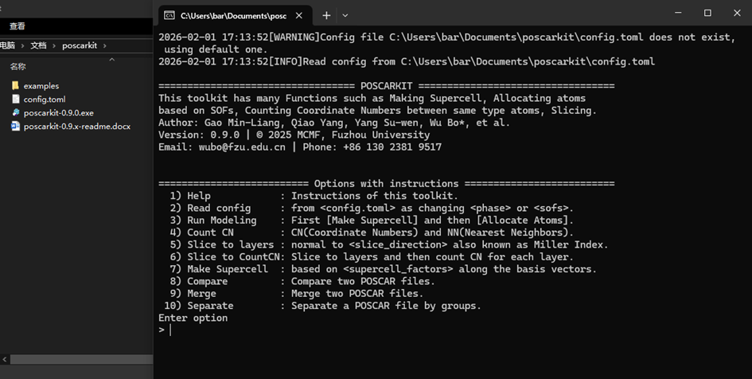
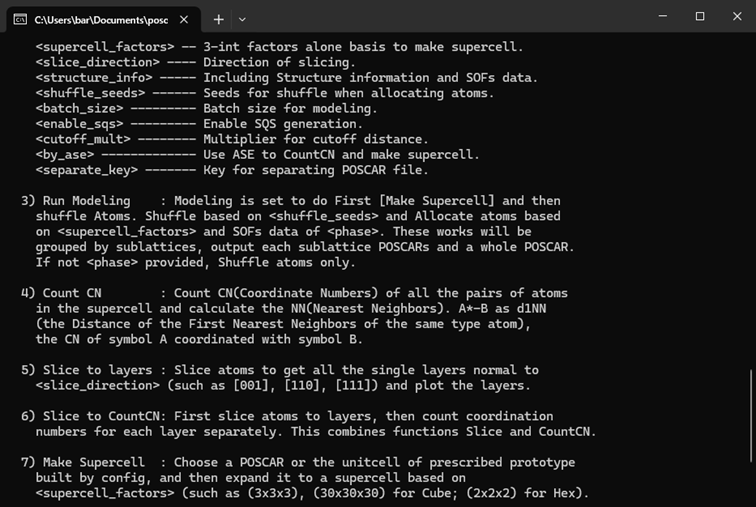
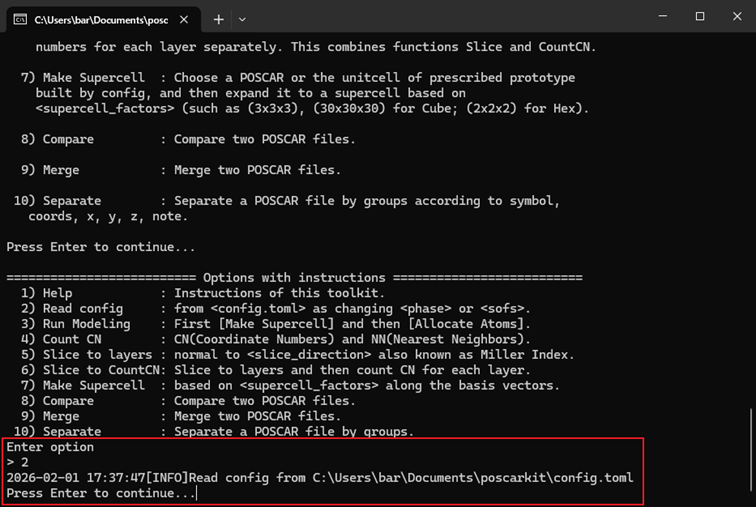
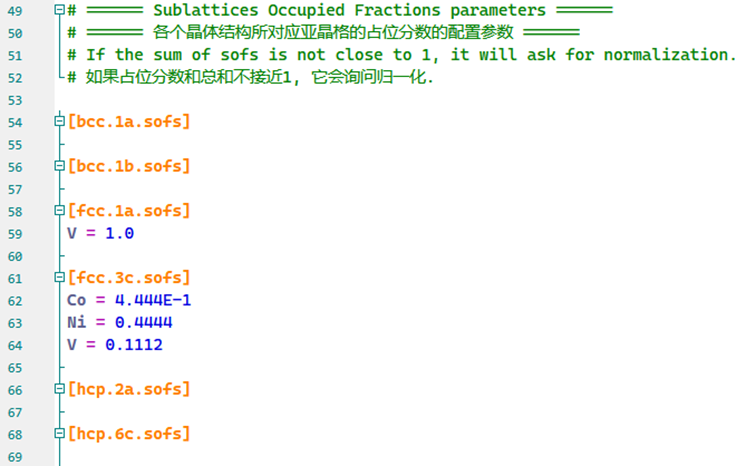
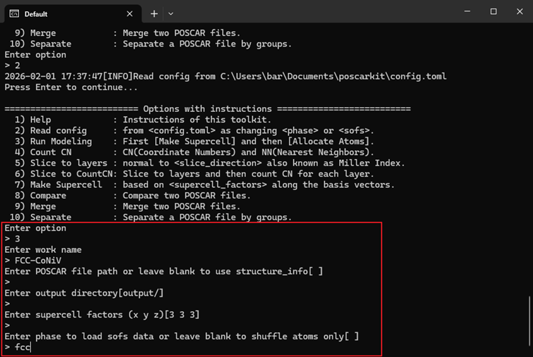
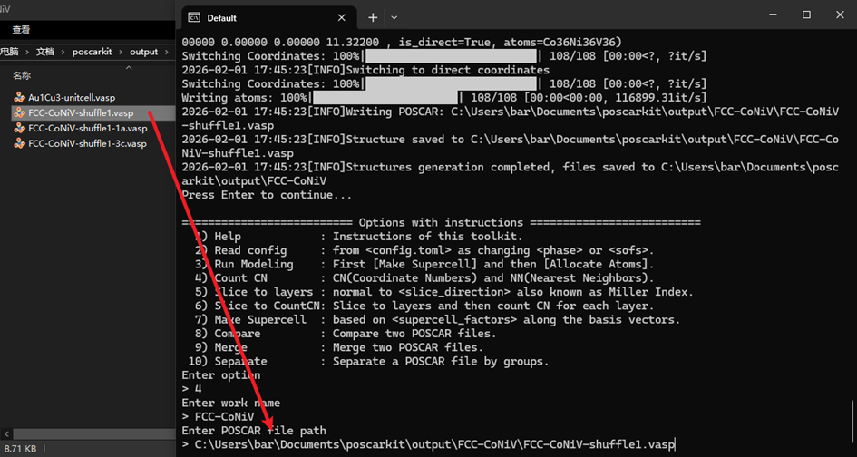
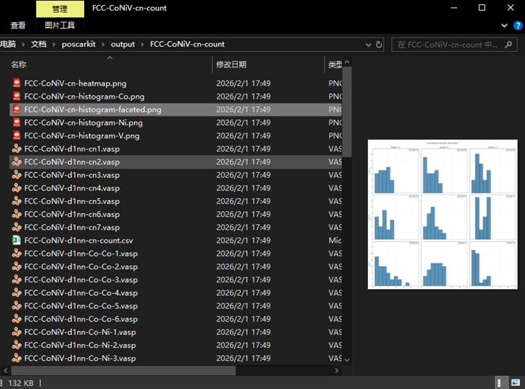
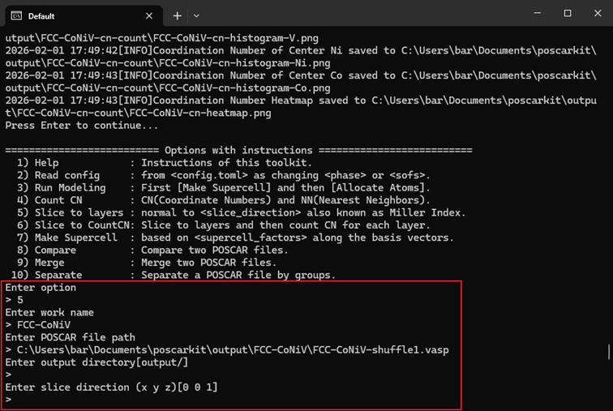
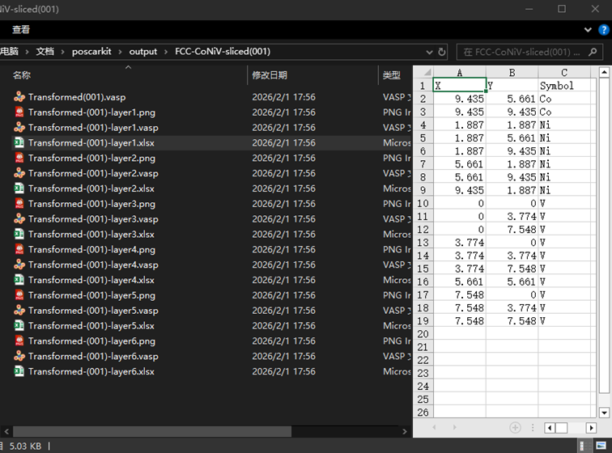
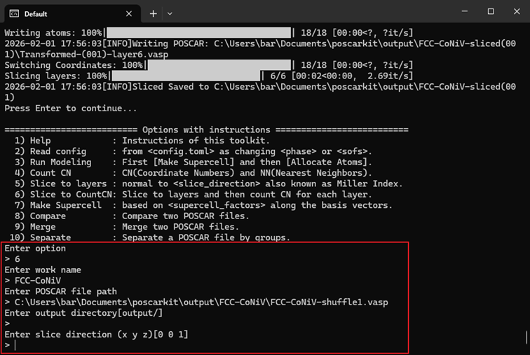

# POSCARKIT 晶体结构建模与分析软件 用户说明书

**软件名称**：POSCARKIT 晶体结构建模与分析软件

**版本号**：V0.9.2

**开发完成日期**：2026年3月9日

**开发单位**：福州大学 材料科学与工程学院 材料基因工程组（MCMF）

---

## 目录

1. [软件概述](#1-软件概述)
   - 1.1 软件简介
   - 1.2 主要功能
   - 1.3 应用领域
2. [运行环境](#2-运行环境)
   - 2.1 硬件环境
   - 2.2 软件环境
3. [安装说明](#3-安装说明)
   - 3.1 可执行文件安装
   - 3.2 源码安装
   - 3.3 启动模式
4. [软件功能说明](#4-软件功能说明)
   - 4.1 帮助功能
   - 4.2 配置文件读取
   - 4.3 建模工作流
   - 4.4 配位数统计
   - 4.5 结构切片
   - 4.6 切片配位数统计
   - 4.7 超胞生成
   - 4.8 结构比较
   - 4.9 结构合并
   - 4.10 结构分离
5. [命令行模式](#5-命令行模式)
6. [配置文件说明](#6-配置文件说明)
7. [输出文件说明](#7-输出文件说明)
8. [常见问题](#8-常见问题)
9. [附录](#附录)

---

## 1 软件概述

### 1.1 软件简介

POSCARKIT 是一款用于处理 VASP POSCAR 文件的晶体结构建模与分析软件，面向材料科学领域的研究人员。本软件基于亚晶格占位分数（Sublattice Occupying Fractions, SOFs）方法\[1\]，整合了超胞生成、原子分配（随机洗牌与特殊准随机结构 SQS 两种模式）、配位数统计、结构切片以及 POSCAR 文件的合并、分离、比较等功能。软件提供命令行和交互式两种操作模式，支持 FCC、BCC、HCP 等常见有序框架结构，并允许用户通过配置文件自定义结构原型。

### 1.2 主要功能

| 功能模块 | 功能描述 |
|----------|----------|
| 建模工作流 | 基于原子占位分数（SOFs）生成随机分配的晶体结构，支持Shuffle和SQS两种模式 |
| 配位数统计 | 统计超胞中所有原子对的配位数（CN）和最近邻（NN）数量，生成可视化图表 |
| 结构切片 | 沿指定晶面方向（Miller指数）对晶体结构进行切片，输出各层原子结构 |
| 切片配位数统计 | 先切片后逐层统计配位数，结合切片和配位数分析功能 |
| 超胞生成 | 根据扩胞因子沿晶格矢量方向生成超胞结构 |
| 结构比较 | 比较两个POSCAR文件的差异（晶格、原子种类、坐标） |
| 结构合并 | 将多个POSCAR文件合并为一个结构文件 |
| 结构分离 | 根据指定条件（原子符号、坐标、备注等）将POSCAR文件分离为多个 |

### 1.3 应用领域

- 高熵合金及固溶体结构建模
- 晶体表面与界面结构研究
- 材料第一性原理计算前处理
- 配位数分布统计分析
- 材料结构数据管理与转换

### 1.4 注意事项

POSCARKIT 在运行过程中不会修改源 POSCAR 文件，所有输出文件均写入用户指定的输出目录。建议用户在操作前对重要数据文件进行备份。

---

## 2 运行环境

### 2.1 硬件环境

| 配置项 | 最低要求 | 推荐要求 |
|--------|----------|----------|
| CPU | 双核处理器 | 四核及以上处理器 |
| 内存 | 4 GB | 8 GB 及以上 |
| 硬盘 | 500 MB 可用空间 | 1 GB 及以上 |
| 显示器 | 1024×768 分辨率 | 1920×1080 分辨率 |

### 2.2 软件环境

| 项目 | 要求 |
|------|------|
| 操作系统 | Windows 10/11（64位）或 Linux（64位） |
| 运行时（可执行文件） | 无需额外安装依赖 |
| 源码运行 | Python 3.10 及以上 |

### 2.3 源码运行依赖

如需从源码运行，需安装以下 Python 依赖包：

| 依赖包 | 版本要求 | 用途 |
|--------|----------|------|
| numpy | >= 2.0 | 数值计算与数组操作 |
| pandas | >= 2.2 | 数据分析与表格输出 |
| matplotlib | >= 3.8 | 科学图表绘制 |
| scipy | >= 1.12 | 科学计算（KDTree、空间距离） |
| ase | >= 3.23 | 原子结构处理 |
| openpyxl | >= 3.1 | Excel文件读写 |
| tqdm | >= 4.66 | 进度条显示 |
| seaborn | >= 0.13 | 热力图绘制 |
| sqsgenerator | >= 0.1 | SQS结构生成 |

---

## 3 安装说明

### 3.1 可执行文件安装

**步骤一**：下载软件

访问 GitHub Releases 页面下载最新版本：
```
https://github.com/Barabama/poscarkit/releases
```

**步骤二**：解压文件

将下载的压缩包解压到目标目录。

**步骤三**：运行软件

双击 `poscarkit.exe` 文件启动软件。



### 3.2 源码安装

**步骤一**：克隆仓库

```bash
git clone https://github.com/Barabama/poscarkit.git
cd poscarkit
```

**步骤二**：安装依赖

```bash
pip install -e .
```

**步骤三**：运行程序

```bash
python main.py
```

### 3.3 启动模式说明

| 启动方式 | 说明 |
|----------|------|
| 双击可执行文件 | 进入交互式模式 |
| 终端不带参数启动 | 进入交互式模式 |
| 终端带命令行参数启动 | 进入命令行模式，执行完成后自动退出 |

---

## 4 软件功能说明

POSCARKIT 提供10项功能，在交互式模式下通过输入对应数字编号选择。

### 4.1 帮助功能

**功能描述**：显示软件版本号、开发者信息、可用命令列表及简要说明。

**操作步骤**：

1. 启动软件后，在主菜单输入 `1` 并按回车键
2. 系统将显示帮助信息

**输出示例**：

```
================================== POSCARKIT ==================================
福州大学 材料科学与工程学院 材料基因工程组（MCMF）
版本: 0.9.2
联系方式: wubo@fzu.edu.cn | +86 130 2381 9517

A tool for modeling structure POSCAR files, based on Sublattice Occupying Fractions (SOFs).
```



---

### 4.2 配置文件读取

**功能描述**：读取 `config.toml` 配置文件，加载预设的结构参数和建模配置。修改配置文件后需重新读取以生效。

**操作步骤**：

1. 在主菜单输入 `2` 并按回车键
2. 系统将自动读取当前目录下的 `config.toml` 文件
3. 若文件不存在，系统将自动生成默认配置文件

**注意事项**：
- 配置文件使用 `#` 作为注释符，不使用的参数在行首添加 `#` 进行注释即可禁用该参数
- 修改配置文件后需及时保存
- 详细的配置项说明见第6章



---

### 4.3 建模工作流

**功能描述**：基于原子占位分数（SOFs）生成随机分配的晶体结构。该功能包含两个主要步骤：首先生成超胞，然后根据SOFs数据随机分配原子。支持两种建模引擎：随机洗牌（Shuffle）和特殊准随机结构（SQS）。

**操作步骤**：

1. 在主菜单输入 `3` 并按回车键
2. 输入项目名称（如 `FCC-CoNiV`）
3. 输入 POSCAR 文件路径，或直接回车使用配置文件中的结构信息
4. 输入扩胞因子（如 `3 3 3`），或直接回车使用默认值
5. 输入晶体结构类型（如 `fcc`、`bcc`、`hcp`）或直接回车跳过（仅做原子随机排列）
6. 系统将生成建模结果

**输入参数说明**：

| 参数 | 说明 | 示例 |
|------|------|------|
| 项目名称 | 本次建模任务的标识名称 | FCC-CoNiV |
| POSCAR路径 | 原胞结构文件路径 | POSCAR.vasp |
| 扩胞因子 | 沿三个晶格方向的扩胞倍数（空格分隔） | 3 3 3 |
| 晶体结构 | 晶体结构类型 | fcc / bcc / hcp |

**输出文件**：

- `{项目名称}-shuffle{序号}-{亚晶格}.vasp`：各亚晶格分配后的结构文件
- `{项目名称}-shuffle{序号}.vasp`：所有亚晶格合并的完整结构文件

**操作示例**：

以 FCC-CoNiV 合金建模为例：

步骤一，打开配置文件 `config.toml`，输入原子占位分数：

```toml
[fcc.1a.sofs]
V = 1.0
[fcc.3c.sofs]
Co = 0.444
Ni = 0.444
V = 0.112
```

步骤二，保存配置文件后，在软件中输入 `2` 重新读取配置。

步骤三，输入 `3` 选择建模功能，按提示输入参数：

```
请输入项目名称: FCC-CoNiV
请输入POSCAR路径(直接回车使用配置文件):
请输入扩胞因子(如 3 3 3): 3 3 3
请输入晶体结构类型(fcc/bcc/hcp): fcc
```






---

### 4.4 配位数统计

**功能描述**：统计 POSCAR 文件中所有原子对的配位数（CN）和最近邻（NN），生成分析报告和可视化图表。支持自动截断距离检测和ASE自然截断两种计算模式。

**操作步骤**：

1. 在主菜单输入 `4` 并按回车键
2. 输入项目名称
3. 输入 POSCAR 文件路径（可将文件拖入终端窗口）
4. 输入输出目录，或直接回车使用默认路径
5. 系统将自动进行配位数统计并生成结果文件

**输出文件**：

结果保存在 `{项目名称}-cn-count/` 目录下：

| 文件名 | 说明 |
|--------|------|
| `{项目名称}-d1nn-cn-count.csv` | 配位数统计表格（CSV格式） |
| `{项目名称}-d1nn-{中心原子}-{近邻原子}-{配位数}.vasp` | 按配位数分类的结构文件 |
| `{项目名称}-d1nn-cn{配位数}.vasp` | 按配位数合并的结构文件 |
| `{项目名称}-cn-histogram-faceted.png` | 配位数分面直方图 |
| `{项目名称}-cn-histogram-{中心原子}.png` | 按中心原子的堆叠直方图 |
| `{项目名称}-cn-heatmap.png` | 平均配位数热力图 |

**操作示例**：

```
请输入项目名称: my_cn_analysis
请输入POSCAR路径: POSCAR.vasp
请输入输出目录(直接回车使用默认):
```





---

### 4.5 结构切片

**功能描述**：沿指定晶面方向（Miller指数）对晶体结构进行切片，生成平行于指定晶面的原子层结构，并提供每层的可视化投影图和Excel坐标表格。

**操作步骤**：

1. 在主菜单输入 `5` 并按回车键
2. 输入项目名称
3. 输入 POSCAR 文件路径
4. 输入输出目录，或直接回车使用默认路径
5. 输入 Miller 指数（如 `0 0 1`、`1 1 1`），或直接回车使用默认值
6. 系统将生成切片文件

**Miller 指数说明**：

| Miller 指数 | 切片方向 |
|-------------|----------|
| 0 0 1 | 沿 c 轴方向切片 |
| 1 1 0 | 沿 (110) 面切片 |
| 1 1 1 | 沿 (111) 面切片 |

**输出文件**：

结果保存在 `{项目名称}-sliced-({Miller指数})/` 目录下：

| 文件名 | 说明 |
|--------|------|
| `Transformed-({Miller指数}).vasp` | 变换后的整体结构文件 |
| `Transformed-({Miller指数})-layer{序号}.vasp` | 各层切片结构文件 |
| `Transformed-({Miller指数})-layer{序号}.png` | 各层切片的可视化投影图 |
| `Transformed-({Miller指数})-layer{序号}.xlsx` | 各层切片的原子坐标表格 |

**操作示例**：

```
请输入项目名称: my_slice
请输入POSCAR路径: POSCAR.vasp
请输入输出目录(直接回车使用默认):
请输入Miller指数(如 0 0 1): 1 1 1
```





---

### 4.6 切片配位数统计

**功能描述**：将结构切片功能和配位数统计功能结合，先沿指定晶面方向切片，然后对每层切片分别进行配位数分析。

**操作步骤**：

1. 在主菜单输入 `6` 并按回车键
2. 输入项目名称
3. 输入 POSCAR 文件路径
4. 输入输出目录，或直接回车使用默认路径
5. 输入 Miller 指数，或直接回车使用默认值
6. 系统将对每层进行配位数统计

**输出文件**：

结果保存在 `{项目名称}-sliced-({Miller指数})/` 目录下，包含：

- `Transformed-({Miller指数})-layer{序号}.vasp`：各层切片结构文件
- `Transformed-({Miller指数})-layer{序号}.png`：各层切片可视化图片（含配位数信息标注）
- `Transformed-({Miller指数})-layer{序号}.xlsx`：各层原子坐标表格
- `Transformed-({Miller指数})-layer{序号}-cn-count/`：各层配位数统计结果目录（内含CSV、VASP、直方图、热力图等）

**操作示例**：

```
请输入项目名称: slice_cn_analysis
请输入POSCAR路径: POSCAR.vasp
请输入输出目录(直接回车使用默认):
请输入Miller指数(如 0 0 1): 0 0 1
```




---

### 4.7 超胞生成

**功能描述**：根据输入的 POSCAR 文件或配置中的结构信息，沿晶格矢量方向扩展，生成指定大小的超胞结构。支持自定义算法和ASE两种生成方式。

**操作步骤**：

1. 在主菜单输入 `7` 并按回车键
2. 输入 POSCAR 文件路径或直接回车使用配置中的结构信息生成单胞
3. 输入扩胞因子（如 `2 2 2`）
4. 输入输出目录
5. 系统将生成超胞文件

**输出文件**：

- `{元素组成}-supercell-{扩胞因子}.vasp`：超胞结构文件（如 `Co1Ni1V1-supercell-3x3x3.vasp`）

---

### 4.8 结构比较

**功能描述**：比较两个 POSCAR 文件的差异，包括晶格参数、原子种类和数量、原子坐标等信息，输出详细比较结果。

**操作步骤**：

1. 在主菜单输入 `8` 并按回车键
2. 输入第一个 POSCAR 文件路径
3. 输入第二个 POSCAR 文件路径
4. 系统将显示比较结果

**比较内容**：

- 晶格矩阵差异
- 原子种类和数量差异
- 原子坐标差异（含缺失和多余原子信息）

---

### 4.9 结构合并

**功能描述**：将多个 POSCAR 文件合并为一个结构文件，保留所有原子的坐标和属性信息。

**操作步骤**：

1. 在主菜单输入 `9` 并按回车键
2. 依次输入要合并的 POSCAR 文件路径（至少2个）
3. 系统询问是否添加更多文件，输入 `y` 继续添加，输入 `n` 完成添加
4. 输入输出目录
5. 系统将生成合并后的结构文件

**输出文件**：

- `POSCAR-merged-{文件名列表}.vasp`：合并后的结构文件

---

### 4.10 结构分离

**功能描述**：根据指定条件（原子符号、坐标、备注等）将一个 POSCAR 文件分离为多个独立的结构文件。

**操作步骤**：

1. 在主菜单输入 `10` 并按回车键
2. 输入 POSCAR 文件路径
3. 输入输出目录
4. 系统根据配置中的分离条件进行分离

**输出文件**：

- `POSCAR-group-{分组名}.vasp`：分离后的结构文件

**分离条件（可通过配置文件 `separate_key` 设置）**：

| 条件 | 说明 |
|------|------|
| symbol | 按原子元素符号分离 |
| coord | 按原子坐标分离 |
| x | 按 x 坐标分离 |
| y | 按 y 坐标分离 |
| z | 按 z 坐标分离 |
| note | 按原子备注（亚晶格标识）分离 |

---

## 5 命令行模式

POSCARKIT 支持命令行模式，可通过参数直接执行各项功能，适用于批量处理和脚本调用场景。

### 5.1 查看帮助

```bash
poscarkit help
```

### 5.2 建模工作流

```bash
# 基本用法
poscarkit modeling --poscar POSCAR.vasp --factors 3 3 3 --name my_model

# 使用配置文件
poscarkit modeling --config config.toml --phase fcc --seeds 1 2 3

# 启用 SQS 生成（需要 --config 和 --phase 提供 SOF 配置）
poscarkit modeling --config config.toml --phase fcc --enable-sqs
```

| 参数 | 简写 | 说明 |
|------|------|------|
| --name | -n | 项目名称 |
| --poscar | -p | POSCAR 文件路径 |
| --factors | -f | 扩胞因子（如 `3 3 3`） |
| --outdir | -o | 输出目录 |
| --config | -c | 配置文件路径 |
| --phase | | 晶体结构类型 |
| --seeds | -s | 随机种子列表 |
| --batch-size | -b | 批量生成数量（默认1） |
| --enable-sqs | -q | 启用SQS生成 |
| --iterations | -i | SQS迭代次数（默认10,000,000） |

### 5.3 配位数统计

```bash
# 基本用法
poscarkit countcn --poscar POSCAR.vasp --name my_cn --outdir output/

# 指定截断半径倍数
poscarkit countcn --poscar POSCAR.vasp --cutoff-mult 1.2

# 并行计算
poscarkit countcn --poscar POSCAR.vasp --parallel 4

# 使用 ASE 计算
poscarkit countcn --poscar POSCAR.vasp --by-ase
```

| 参数 | 简写 | 说明 |
|------|------|------|
| --name | -n | 项目名称 |
| --poscar | -p | POSCAR 文件路径（必需） |
| --outdir | -o | 输出目录 |
| --cutoff-mult | -m | 截断半径倍数（默认1.1） |
| --parallel | -j | 并行进程数（默认2） |
| --by-ase | -a | 使用ASE计算配位数 |

### 5.4 结构切片

```bash
poscarkit slice --poscar POSCAR.vasp --miller-index 1 1 1 --outdir output/
```

| 参数 | 简写 | 说明 |
|------|------|------|
| --name | -n | 项目名称 |
| --poscar | -p | POSCAR 文件路径（必需） |
| --outdir | -o | 输出目录 |
| --miller-index | -i | Miller指数（必需，如 `1 1 1`） |

### 5.5 切片配位数统计

```bash
poscarkit slice-to-countcn --poscar POSCAR.vasp --miller-index 1 1 1 --outdir output/
```

参数同结构切片（§5.4）。

### 5.6 超胞生成

```bash
# 基本用法
poscarkit supercell --poscar POSCAR.vasp --factors 2 2 2 --outdir output/

# 使用 ASE 生成
poscarkit supercell --poscar POSCAR.vasp --factors 2 2 2 --by-ase
```

| 参数 | 简写 | 说明 |
|------|------|------|
| --poscar | -p | POSCAR 文件路径（必需） |
| --factors | -f | 扩胞因子（默认 `3 3 3`） |
| --outdir | -o | 输出目录 |
| --by-ase | -a | 使用ASE生成超胞 |

### 5.7 结构比较

```bash
poscarkit compare --poscar1 POSCAR1.vasp --poscar2 POSCAR2.vasp
```

### 5.8 结构合并

```bash
# 合并两个文件
poscarkit merge --poscars POSCAR1.vasp POSCAR2.vasp --outdir output/

# 合并多个文件
poscarkit merge --poscars POSCAR1.vasp POSCAR2.vasp POSCAR3.vasp --outdir output/
```

### 5.9 结构分离

```bash
# 按备注分离
poscarkit separate --poscar POSCAR.vasp --key note --outdir output/

# 按原子符号分离
poscarkit separate --poscar POSCAR.vasp --key symbol --outdir output/
```

---

## 6 配置文件说明

### 6.1 配置文件格式

配置文件采用 TOML 格式，文件名为 `config.toml`，存放于程序运行目录下。不需要配置所有内容，未配置的参数程序会在运行时询问用户。

```toml
# ==================== 基本配置（均可选填） ====================

# 工作名称
# name = "MyWork"

# POSCAR 文件路径
# poscar = "./examples/CoNiV.vasp"

# 输出目录
# outdir = "./output/"

# 晶体结构类型（fcc / bcc / hcp）
# phase = "fcc"

# 超胞因子（默认 [3, 3, 3]）
# supercell_factors = [3, 3, 3]

# 切片方向（默认 [0, 0, 1]，即沿 z 轴方向切片）
# slice_direction = [0, 0, 1]

# 随机种子列表（用于复现建模结果）
# shuffle_seeds = [7, 42, 83]

# 建模批次大小（默认 1）
# batch_size = 3

# 启用 SQS 生成（默认 false）
# enable_sqs = false

# 配位数统计截断倍数（默认 1.1）
# cutoff_mult = 1.1

# 使用 ASE 计算配位数（默认 false）
# by_ase = false

# 分离操作的分组依据（可选 symbol / coord / x / y / z / note）
# separate_key = "note"

# ==================== 原子占位分数（SOFs）配置 ====================
# 格式：[{phase}.{site}.sofs]
# 每个亚晶格位置的原子分数之和应等于 1.0
# 若不等于 1.0，程序将询问是否归一化

[fcc.1a.sofs]
V = 1.0

[fcc.3c.sofs]
Co = 0.4444
Ni = 0.4444
V = 0.1112

[bcc.1a.sofs]

[bcc.1b.sofs]

# ==================== 单胞结构信息（修改时请谨慎） ====================
# 格式：[{phase}] 下用 cell 定义晶格参数（3个对角线值或3×3矩阵）
#        {site}.atoms 定义该亚晶格位置的元素符号和分数坐标

[fcc]
cell = [3.774, 3.774, 3.774]
1a.atoms = ["Au", [[0, 0, 0]]]
3c.atoms = ["Cu", [[0, 0.5, 0.5], [0.5, 0, 0.5], [0.5, 0.5, 0]]]

[bcc]
cell = [2.7, 2.7, 2.7]
1a.atoms = ["Al", [[0, 0, 0]]]
1b.atoms = ["Ni", [[0.5, 0.5, 0.5]]]

[hcp]
cell = [[2.6525, -4.593, 0], [2.6525, 4.593, 0], [0, 0, 4.242]]
2a.atoms = ["Sn", [[0.3333, 0.6667, 0.25], [0.6667, 0.3333, 0.75]]]
6c.atoms = ["Ni", [[0.1596, 0.8404, 0.75], [0.1596, 0.3192, 0.75],
                  [0.3192, 0.1596, 0.25], [0.6808, 0.8404, 0.75],
                  [0.8404, 0.6808, 0.25], [0.8404, 0.1596, 0.75]]]
```

### 6.2 原子占位分数（SOFs）说明

原子占位分数通过 `[{phase}.{site}.sofs]` 小节定义各亚晶格位置的原子组成比例，是建模工作流的核心配置：

```toml
# 示例：FCC 结构 1a 位置全部被 V 占据
[fcc.1a.sofs]
V = 1.0

# 示例：FCC 结构 3c 位置被三种原子按比例占据
[fcc.3c.sofs]
Co = 0.4444
Ni = 0.4444
V = 0.1112
```

**规则说明**：
- 每个亚晶格位置的原子分数之和应等于 1.0
- 如果不接近 1.0，程序会提示用户确认是否归一化（输入 `y` 归一化，输入 `n` 终止程序）
- 分数值表示该位置被对应原子占据的概率
- 支持添加自定义结构类型（参照 `[fcc]` 的格式在配置文件中新增 `[MyPhase]` 段落）

### 6.3 自定义结构类型

用户可以在配置文件中添加自定义晶体结构：

```toml
# phase = "MyPhase"
# [MyPhase]
# cell = [[2, 2, 0], [2, 2, 0], [0, 0, 3.8]]
# subl1.atoms = ["Au", [[0, 0, 0]]]
# subl2.atoms = ["Cu", [[0.5, 0.5, 0.5]]]
# [MyPhase.subl1.sofs]
# Au = 1.0
# [MyPhase.subl2.sofs]
# Cu = 1.0
```

---

## 7 输出文件说明

### 7.1 文件类型

| 文件扩展名 | 说明 |
|------------|------|
| .vasp | VASP POSCAR 结构文件 |
| .csv | 逗号分隔值数据表格 |
| .xlsx | Microsoft Excel 数据表格 |
| .png | 便携式网络图形图像文件 |
| .toml | TOML 配置文件 |

### 7.2 输出文件命名规则

| 功能 | 输出文件名格式 |
|------|----------------|
| 建模 | `{项目名称}-shuffle{序号}-{亚晶格}.vasp`、`{项目名称}-shuffle{序号}.vasp` |
| 配位数统计 | `{项目名称}-d1nn-{中心原子}-{近邻原子}-{配位数}.vasp`、`{项目名称}-d1nn-cn-count.csv` |
| 切片 | `Transformed-({Miller指数})-layer{序号}.vasp` / `.png` / `.xlsx` |
| 超胞 | `{元素组成}-supercell-{扩胞因子}.vasp`（如 `Co1Ni1V1-supercell-3x3x3.vasp`） |
| 合并 | `POSCAR-merged-{文件名列表}.vasp` |
| 分离 | `POSCAR-group-{分组名}.vasp` |

### 7.3 配位数统计 CSV 表格说明

配位数统计结果 CSV 文件包含以下字段：

| 列名 | 说明 |
|------|------|
| CN | 配位数信息，格式为 `{中心原子}*-{配位数}{近邻原子}`，如 `Co*-12Ni` 表示 Co 原子周围有12个 Ni 近邻 |
| Count | 该配位数组合在结构中的出现次数 |

---

## 8 常见问题

### Q1: 软件无法启动怎么办？

**解决方案**：
1. 检查操作系统是否为 64 位版本
2. 检查是否有杀毒软件拦截，尝试将软件添加至白名单
3. 尝试以管理员身份运行

### Q2: 配置文件读取失败怎么办？

**解决方案**：
1. 确认配置文件名为 `config.toml` 且位于程序运行目录下
2. 检查文件编码是否为 UTF-8
3. 检查 TOML 格式是否正确（特别是方括号、等号、引号的使用）
4. 程序首次运行时会自动生成默认配置文件

### Q3: POSCAR 文件无法读取怎么办？

**解决方案**：
1. 确认文件路径正确（可将文件直接拖入终端窗口自动填入路径）
2. 检查 POSCAR 文件格式是否符合 VASP 标准（第1行注释、第2行缩放因子、第3-5行晶格矢量、第6-7行原子种类和数量、第8行坐标类型）
3. 确认文件编码为 ASCII 或 UTF-8

### Q4: 配位数统计结果不准确怎么办？

**解决方案**：
1. 调整 `--cutoff-mult` 参数增大截断半径（默认1.1，可尝试1.2或1.3）
2. 尝试使用 `--by-ase` 参数切换至 ASE 自然截断模式
3. 检查 POSCAR 文件中的晶格参数是否正确

### Q5: 建模结果中原子分数总和不为1.0？

**解决方案**：
程序在读取SOFs配置时会自动检测各亚晶格位置的分数总和，如果偏离1.0会提示用户确认归一化，输入 `y` 后系统将自动执行归一化处理。

### Q6: 如何获取更多帮助？

**联系方式**：
- 邮箱：wubo@fzu.edu.cn
- 电话：+86 130 2381 9517
- GitHub 项目主页：https://github.com/Barabama/poscarkit

---

## 9 附录

### 附录 A：支持的晶体结构类型

| 结构类型 | 代码 | 英文全称 | 说明 |
|----------|------|----------|------|
| 面心立方 | fcc | Face-Centered Cubic | 原子位于立方体顶点和面心 |
| 体心立方 | bcc | Body-Centered Cubic | 原子位于立方体顶点和体心 |
| 六方密排 | hcp | Hexagonal Close-Packed | 原子按ABAB序列密排 |

### 附录 B：操作提示

| 操作 | 说明 |
|------|------|
| Ctrl + C | 终止当前操作，返回主菜单（交互式模式）或退出程序（命令行模式） |
| 拖拽文件到终端 | 快速输入 POSCAR 文件的完整路径 |
| 直接回车 | 使用方括号 `[ ]` 中标注的默认值 |
| 输入 y / n | 确认或取消操作（如归一化确认、继续添加文件等） |

### 附录 C：版本更新记录

| 版本号 | 更新日期 | 更新内容 |
|--------|----------|----------|
| V0.9.2 | 2026-03-09 | 初始正式版本：包含超胞生成、基于SOFs的原子分配（Shuffle和SQS两种模式）、配位数统计（自动截断检测和ASE模式）、结构切片（含图层可视化）、POSCAR文件合并/分离/比较、命令行和交互式双模式操作、并行计算支持 |

### 附录 D：参考文献

1. Wu B.\*, Zhao Y.\*, Ali H., et al. A reasonable approach to describe the atom distributions and configurational entropy in high entropy alloys based on site preference. *Intermetallics*, 144 (2022), 107489.
2. Kresse, G., & Furthmüller, J. Efficient iterative schemes for ab initio total-energy calculations using a plane-wave basis set. *Physical Review B*, 54(16), 11169–11186, 1996.
3. Hjorth Larsen, A., et al. The Atomic Simulation Environment—A Python library for working with atoms. *Journal of Physics: Condensed Matter*, 29(27), 273002, 2017.
