# POSCARKIT 基于占位分数的多元合金结构建模与分析软件 用户说明书

**版本号**：V0.10.5

**开发单位**：福州大学 材料科学与工程学院 材料基因工程组（MCMF）

**编制日期**：2026年6月11日

---

## 一、相关文档

本操作手册配套以下技术文档，供使用者查阅软件设计细节和测试信息。

| 文档名称 | 说明 |
|----------|------|
| POSCARKIT设计说明书 | 软件系统架构、功能模块划分和核心算法设计说明 |
| POSCARKIT配置文件模板（config.toml） | 项目根目录下的默认配置文件，含FCC/BCC/HCP结构原型参数 |

---

## 二、说明

POSCARKIT面向从事第一性原理计算的科研人员，解决高熵合金、固溶体等多元合金材料的结构建模和前处理问题。软件以亚晶格占位分数方法为核心，将CALPHAD热力学计算获得的亚晶格占位分数转化为具体原子排布的超胞结构文件，并为建模结果提供配位数统计、晶面切片、表面平板构建和热力学分析等后续处理。

软件覆盖从热力学数据导入到结构模型输出再到质量分析的完整链路。用户可以从Thermo-Calc或Pandat输出的占位分数数据出发，通过配置驱动的工作流生成VASP可读取的POSCAR格式结构文件，然后直接在软件内完成配位数分布统计、沿指定晶面切片或构建表面Slab模型。

软件提供图形界面和命令行两种操作方式。图形界面是默认入口，将各项功能组织为侧边导航和参数表单，点击即可执行。命令行模式接受子命令和参数，适合脚本批处理和远程服务器调用。两种方式共享同一套功能执行逻辑，结果一致。

---

## 三、功能特点

软件支持从体心立方、面心立方、密排六方等常见晶体结构出发构建超胞。用户无需准备初始POSCAR文件，只需在配置中指定结构类型和超胞尺寸，软件即自动生成对应原胞并扩展为超胞。对于需要从CALPHAD计算结果出发的用户，软件提供占位分数数据导入功能。将Thermo-Calc或Pandat导出的数据文件拖入界面，软件自动识别格式并提取各温度点下每个亚晶格位点的占位分数，计算各元素在各亚晶格上应分配的原子数量。

原子分配提供随机和准随机两种策略。随机分配模式可批量生成多组随机种子对应的结构，利用多核心并行加速。准随机结构模式对每个亚晶格独立优化对关联函数，使有限超胞内的原子排布逼近理想随机固溶体的统计特性。分配过程中各亚晶格位点的占位分数到整数原子数量的转换明细会保存为表格文件，便于追溯和校验。

配位数统计功能首先自动检测晶体结构中第一近邻与第二近邻的截断距离，免去手动设定截断半径。随后利用空间索引对所有原子进行近邻搜索，统计每个原子的各元素配位数和原子对频次。结果输出包括按配位数分组的POSCAR结构文件、累积配位数分类文件、统计表格以及直方图和热力图。开启周期性边界条件后，计算采用最小镜像约定处理跨边界原子对，适合小超胞或单胞场景。

晶面切片功能沿用户指定的米勒指数方向（如001、110、111或自定义方向）将三维结构切分为独立的原子层。每层输出独立的POSCAR结构文件、面内原子投影散点图和原子坐标数据表。散点图上标注10埃标尺，方便直观判断层内原子间距。

表面Slab建模从体相结构出发，按指定米勒指数构建非对称表面平板模型。软件自动识别原子层、检测层间间隙确定切割位置，然后对选定层数的原子坐标去周期化展开并组装为含真空区的Slab结构。输出的Slab文件自动应用选择性动力学约束标记，默认固定底部半数原子层。同时生成质量评估汇总表，包含组成偏差、偶极矩和表面能估算值。

热力学分析模块内置CALPHAD热力学数据库格式解析器，可读取TDB文件提取端元Gibbs自由能参数并展开被引用的温度函数表达式。结合导入的占位分数数据，计算各温度下实际固溶体的构型熵和Gibbs自由能，同时给出完全随机混合假设下的参考值作为对比。计算结果以双面板曲线图和CSV表格两种形式输出。

命令行模式覆盖全部功能，提供建模、配位数统计、切片、切片到配位数、超胞生成、文件比较、文件合并、文件分离、导入建模、热力学分析和表面Slab生成共十一个功能子命令，以及一个帮助子命令。每个子命令接受完整的参数集，可嵌入Shell脚本或作业调度系统实现批量处理。图形界面配置的参数可以保存为TOML配置文件，命令行模式下直接引用，保持参数体系一致。

---

## 四、系统要求

| 配置项 | 最低要求 | 推荐配置 |
|--------|----------|----------|
| 操作系统 | Windows 10 64位 / Linux 64位 | Windows 11 64位 / Ubuntu 20.04+ 64位 |
| 处理器 | 双核 x86-64 | 四核及以上 |
| 内存 | 4 GB | 8 GB 或更高 |
| 硬盘空间 | 500 MB 可用 | 1 GB 可用（含输出文件空间） |
| 显示分辨率 | 1280×720 | 1920×1080 |
| Python版本 | ≥3.10 | ≥3.11 |

软件以Python包形式分发，在项目根目录执行 `pip install -e .` 即可完成可编辑安装，依赖的数值计算库、数据处理库、可视化库和材料科学工具包在安装时自动解析。软件支持通过Nuitka编译为独立可执行文件，编译后无需Python环境即可运行。

---

## 五、主界面与配置管理

启动软件后呈现左右分栏的图形界面。左侧为功能导航栏，按功能类别分成五个区段，每个区段包含若干带颜色标记的按钮。从上到下依次为：配置管理入口、建模与导入类功能、结构分析类功能、表面与热力学功能、文件操作功能，以及末端的灰色关于按钮。点击任一按钮，右侧区域切换为对应的参数表单。右侧顶部为表单区，底部为实时日志输出区，显示任务执行状态和结果摘要。日志区最多保留五千行，历史记录可向上滚动查看。

配置管理是其他功能的基础入口。点击"Config"按钮进入配置界面后，顶部显示配置文件路径和Phase下拉框。选择相结构（如FCC、BCC、HCP或自定义相）后，下方以分组框形式展示该相各亚晶格位点的可编辑SOF表格，每行包含元素符号和占位分数两个输入框。各亚晶格位点下方实时显示SOF总和校验：等于1.0时显示绿色文字，偏离时显示红色文字。用户可点击"+ Add"按钮为当前位置增加元素行，或点击"-"按钮删除已有行。编辑完成后点击保存将SOF写回TOML配置文件。配置文件中自定义的相结构会自动出现在其他功能的Phase下拉框中。

配置文件还包含各功能的默认参数值，如默认输出目录、超胞尺寸默认值、配位数统计精度、切片方向列表等。用户修改表单参数后点击"Save Config"可将当前表单值持久化，下次打开软件时自动回填。

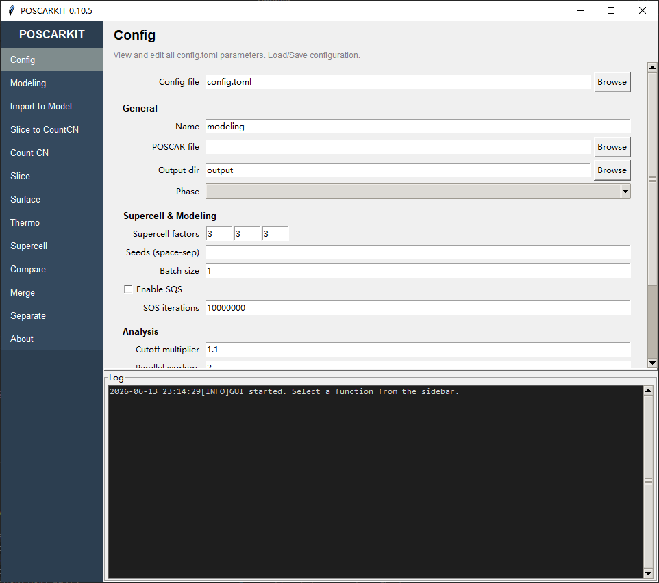

软件主界面的左侧功能导航栏按五个区段组织十三项功能入口，每个按钮以颜色区分功能类别，点击后在右侧加载对应的参数表单。

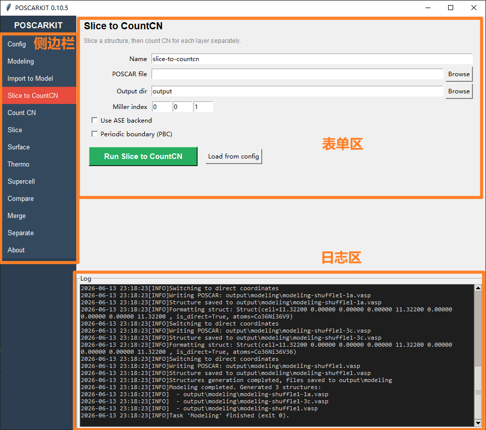

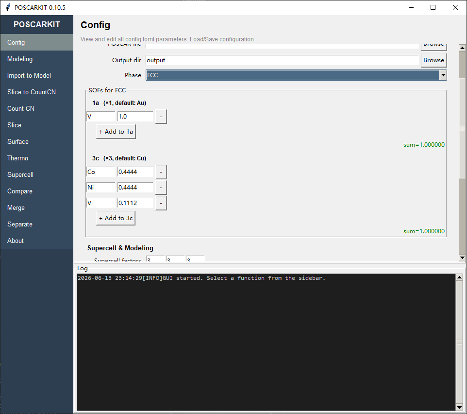

---

## 六、建模与数据导入

### 结构建模

建模功能将配置文件中的结构原型和占位分数转化为包含具体原子排布的POSCAR超胞文件。用户先在"Phase"下拉框中选择目标结构相（如FCC、BCC、HCP或自定义相），然后在"Supercell factors"三个输入框中填写各晶格方向的超胞扩展倍数。如需批量生成多组不同随机种子对应的结构，在"Batch size"中设置批次数，"Seeds"输入框中以空格分隔指定随机种子列表。勾选"Enable SQS"复选框后可在"SQS iterations"中设置优化迭代次数。参数填写完成后点击界面底部"Run"按钮启动任务。

任务在后台异步执行，日志区实时显示当前处理的批次序号和用时。原子分配记录保存为CSV文件，列出各亚晶格位点的占位分数输入值、计算得到的整数分配和最终原子数量。当选中SQS模式时，每个亚晶格独立进行对关联函数优化，多个亚晶格的结果在完成后合并。

输出的POSCAR文件命名包含结构相名称、超胞尺寸和批次序号，存放在指定的输出目录中。

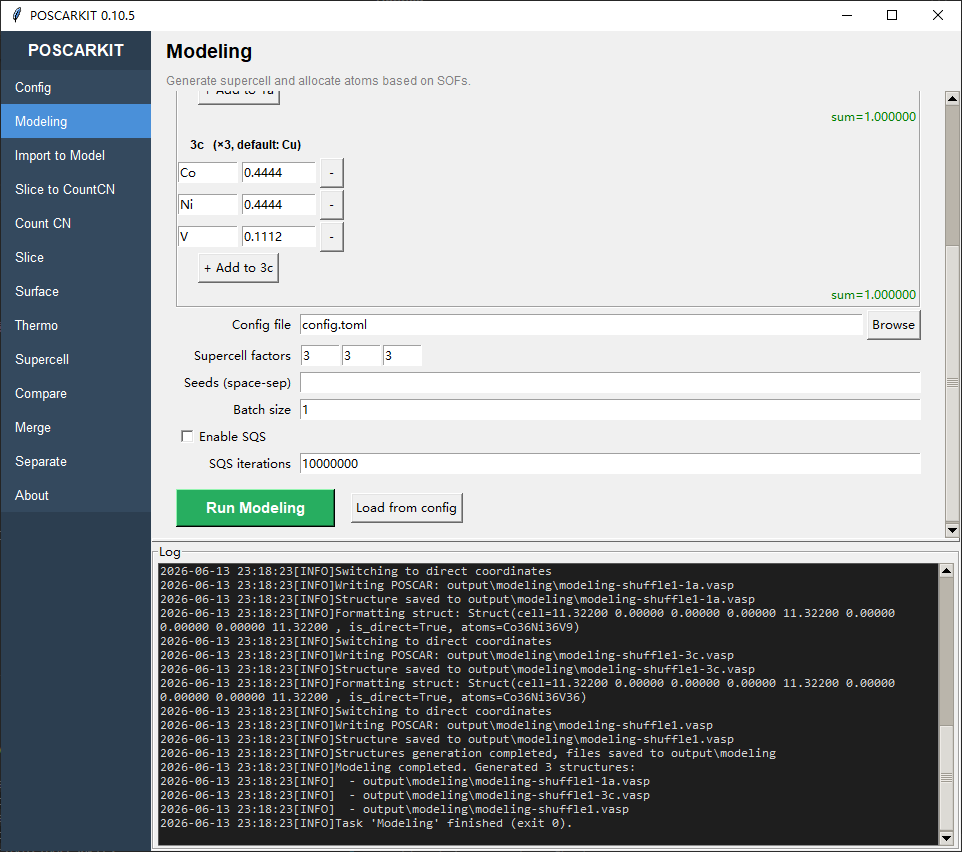

### 数据导入建模

此功能打通了CALPHAD热力学计算到原子结构建模的数据链路。用户点击"Import to Model"进入，首先在"CSV/XLSX file"栏浏览选择Thermo-Calc或Pandat输出的SOF数据文件。软件自动检测文件格式，无需用户指定来源。加载成功后，界面显示文件中包含的温度点列表和各亚晶格的占位分数摘要。

"Sublattice Map"输入框指定CALPHAD亚晶格编号到Wyckoff位点名称的映射关系，格式为"1:1a,2:3c"表示CALPHAD的亚晶格1对应晶体学位点1a、亚晶格2对应位点3c。对于FCC、BCC和HCP结构，软件内置了默认映射关系，用户可留空使用默认值。

温度点在文本框中输入，多个温度以空格分隔。对每个选定温度，软件提取该温度下各亚晶格的占位分数，注入结构模板后执行建模工作流。输出模式提供三种选项：直接运行建模生成POSCAR结构文件，仅保存当前参数为配置文件片段，或在日志区打印数据摘要供检查。

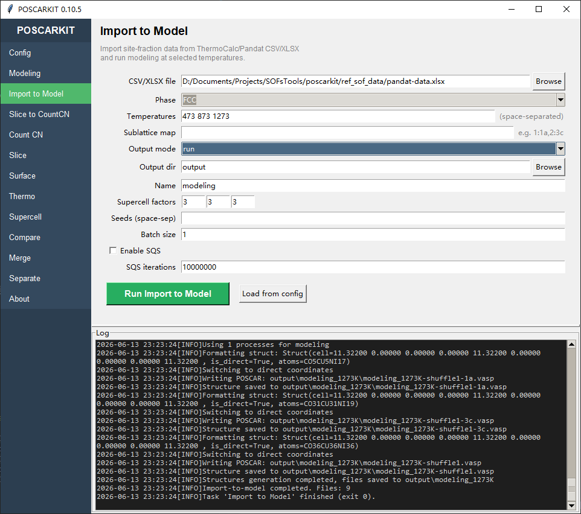

### 超胞生成

此功能从给定的POSCAR原胞文件直接扩展生成超胞，不涉及原子类型更改。用户选择一个POSCAR原胞文件，填写三个方向的扩展倍数，点击执行即可。适用于已有确定元素排布的原胞需要放大尺寸的场景，也支持从外部结构原型构建超胞。软件提供手动实现和ASE两种后端算法，可通过复选框切换。

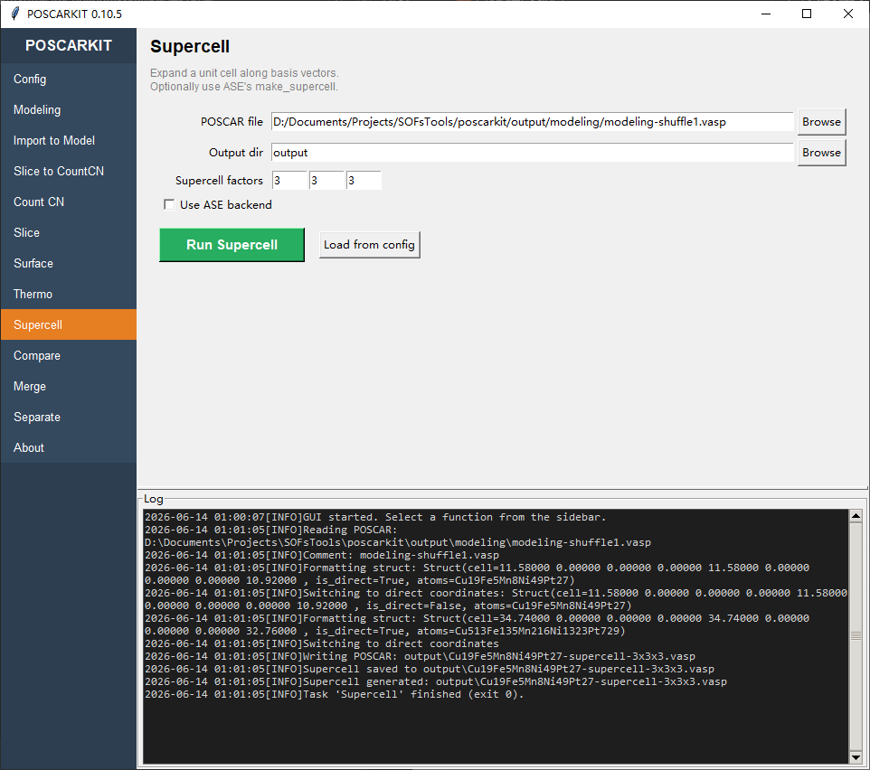

---

## 七、配位数统计与结构切片

### 配位数统计

配位数统计功能对POSCAR结构文件中所有原子进行近邻搜索，统计每个原子的配位数和各元素对的配位关系。用户选择一个POSCAR文件，指定输出目录和任务名称。

软件自动检测第一近邻与第二近邻之间的截断距离，免去用户手动设定。"Cutoff multiplier"输入框为截断距离的容差缩放系数，默认值1.1可将自动检测到的分界值放大10%，用户可根据体系特征调整此系数以获得合理的配位数结果。"Parallel workers"设置并行工作进程数，加快大量原子的近邻搜索速度。

勾选"Periodic boundary (PBC)"复选框启用周期性边界条件，原子对距离采用最小镜像约定计算，适合不能忽略边界效应的单胞或小超胞场景。勾选"Use ASE backend"可切换至ASE自然半径方案，此时PBC自动启用。

执行完成后，输出目录包含按配位数值分类的POSCAR结构文件（例如CN=12的原子单独输出为一份POSCAR）、累积配位数文件（CN≥某值的原子集合）、包含每类原子配位数统计和累积值的CSV表格、直方图（分面和堆叠两种样式）以及元素对平均配位数热力图。

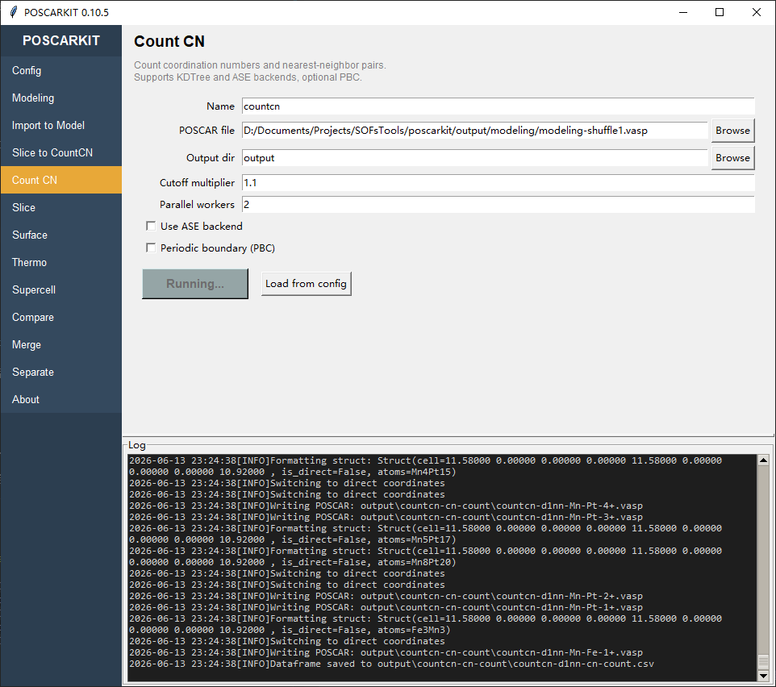

### 结构切片

切片功能沿指定晶面方向将三维结构切分为独立的二维原子层。用户选择POSCAR文件后，指定输出目录和切片方向。米勒指数通过三个整数输入框分别填写h、k、l分量，支持任意自定义方向。

软件首先根据晶面指数确定切片基底并重构坐标系，使新z轴对齐面法线方向。然后将每个原子按其在新z轴上的投影距离取整分组，跨周期性边界的同层原子自动识别合并。

每层独立生成一份POSCAR文件、一张面内原子投影散点图和一份坐标数据Excel表格。散点图上绘制10埃长度的参考标尺和半透明白色背景框，方便直观判断层内原子间距。

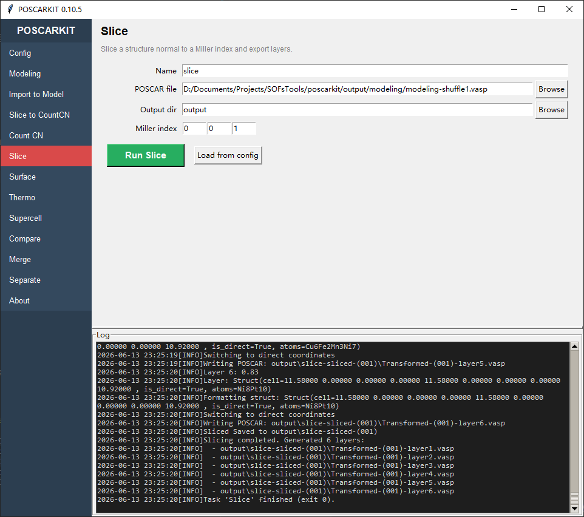

### 切片到配位数

此功能将切片和配位数统计串联执行。用户提供POSCAR文件和切片方向，软件先执行切片操作得到各层结构，再对每一层自动运行配位数统计，生成直方图和热力图。参数设置包含米勒指数、周期边界条件和ASE后端切换选项。适合需要同时了解不同层的原子排布和近邻环境的研究场景。

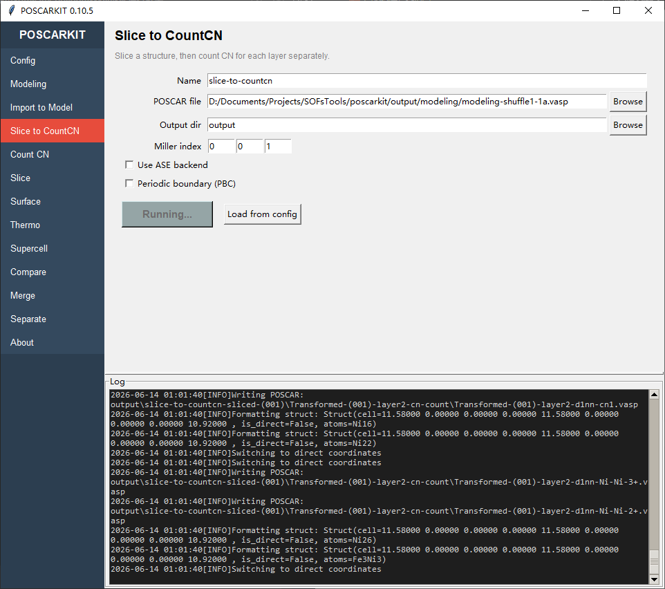

---

## 八、表面建模与热力学分析

### 表面Slab建模

表面建模功能从体相POSCAR文件构建非对称表面Slab模型。用户提供体相结构文件、指定米勒指数和输出信息后启动生成。

软件按米勒指数构造新基底组使面法线对齐z轴，将原子按其分数z坐标取整分组识别独立的原子层。相邻原子层的z质心中点构成候选切割平面。用户可指定生成的层数，软件对每个有效切割平面向下选取N层和N+1层原子，生成两个版本供比较。生成过程中，坐标先做去周期化展开处理消除跨边界跳跃，然后转换为笛卡尔坐标并构建含真空区的新晶格。

真空区厚度默认为15埃，用户可调整。选择性动力学约束默认固定底部半数原子层（标记为F F F），用户可切换为仅固定法线方向（T T F）或手动指定固定层数。

每次生成后输出POSCAR结构文件和一份质量评估汇总CSV表，包含每层元素组成、整体组成与目标组成的偏离量、偶极矩和表面能估算值。

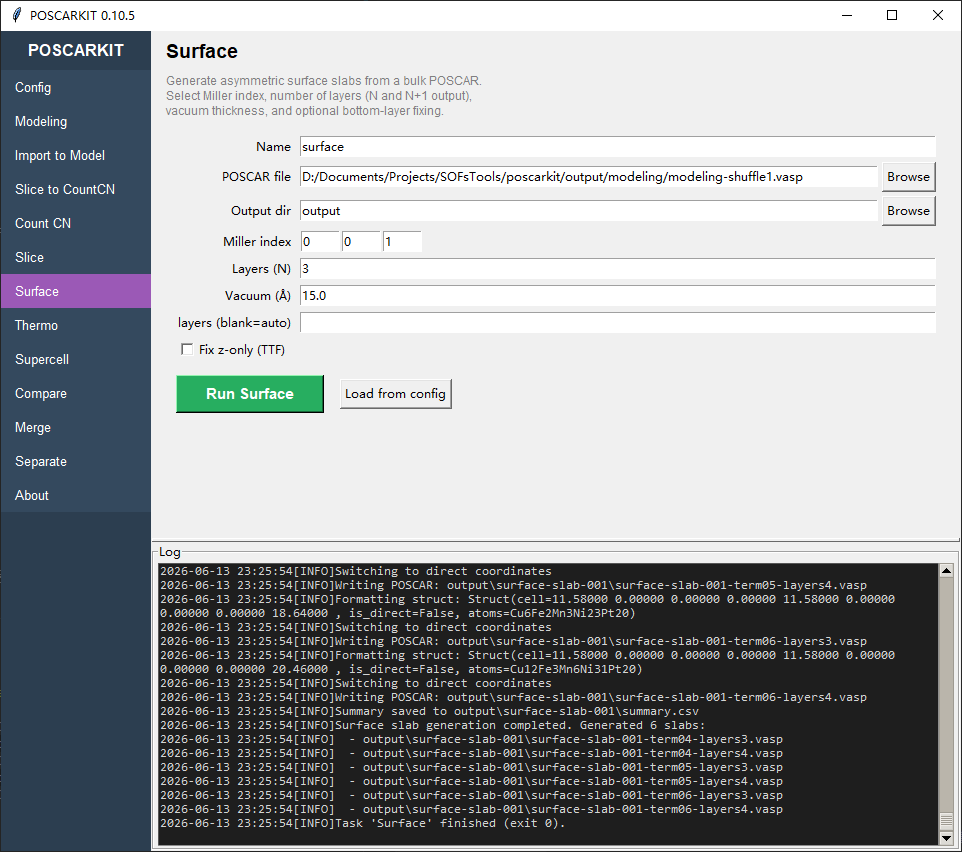

### 热力学分析

热力学分析功能从SOF数据文件和CALPHAD热力学数据库文件出发，计算构型熵和Gibbs自由能随温度的变化。用户在"Data file (xlsx/csv)"和"TDB file"两个浏览框分别选择输入文件。SOF数据文件格式自动检测，TDB文件为纯文本。

软件按TDB语法解析文本，提取FUNCTION记录（温度依赖函数）、PARAMETER G类记录（端元Gibbs自由能参数）和各PHASE记录的亚晶格化学计量比。被引用的函数展开为可直接求值的纯温度变量表达式。构型熵计算采用通用N亚晶格公式，适配FCC、BCC、HCP等不同亚晶格数量的相。

计算结果以双面板图表输出：左面板为构型熵-温度曲线（含实际SOFs和随机混合假设两条曲线），右面板为Gibbs自由能-温度曲线。同时保存为CSV表格文件。

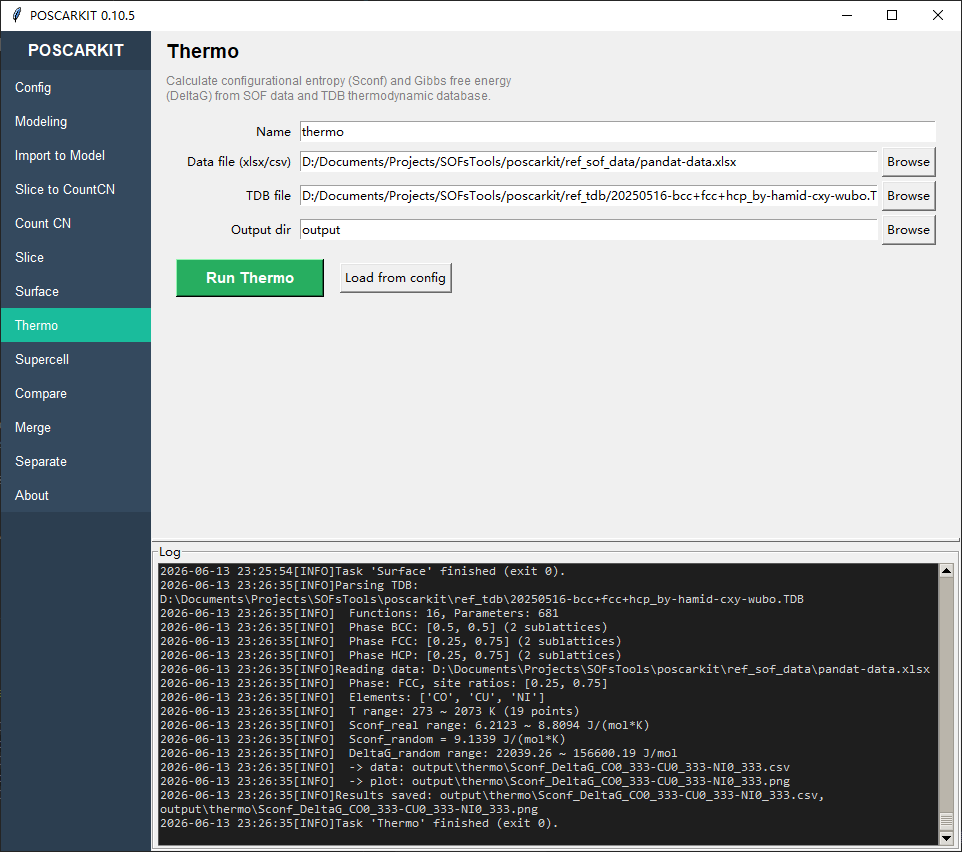

---

## 九、文件操作

### 文件比较

比较功能对两份POSCAR文件进行结构层面的差异检测。用户选择两个POSCAR文件后，软件逐项比对晶格矩阵的每个元素、各元素的原子数量、以及按坐标排序后的原子位置列表。比较结果输出到日志区，逐条列出晶格矩阵差异、元素数量差异和原子坐标差异项。

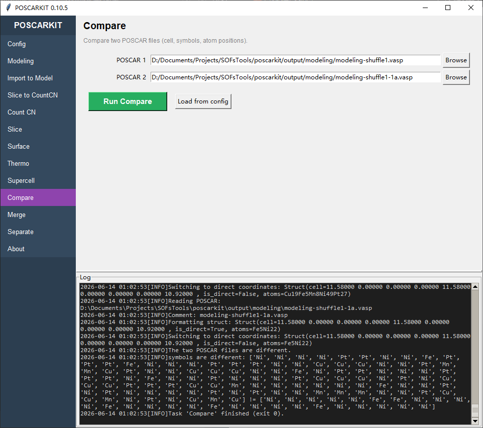

### 文件合并

合并功能将多份POSCAR文件合成为一个结构文件。用户通过"Add"按钮逐一添加POSCAR文件至列表中，"Remove"按钮可移除列表中选中的文件。执行后软件按列表中顺序合并所有文件的原子，输出一份包含全部原子的POSCAR文件。参与合并的各文件应具有相同的晶格矩阵以确保物理意义正确。

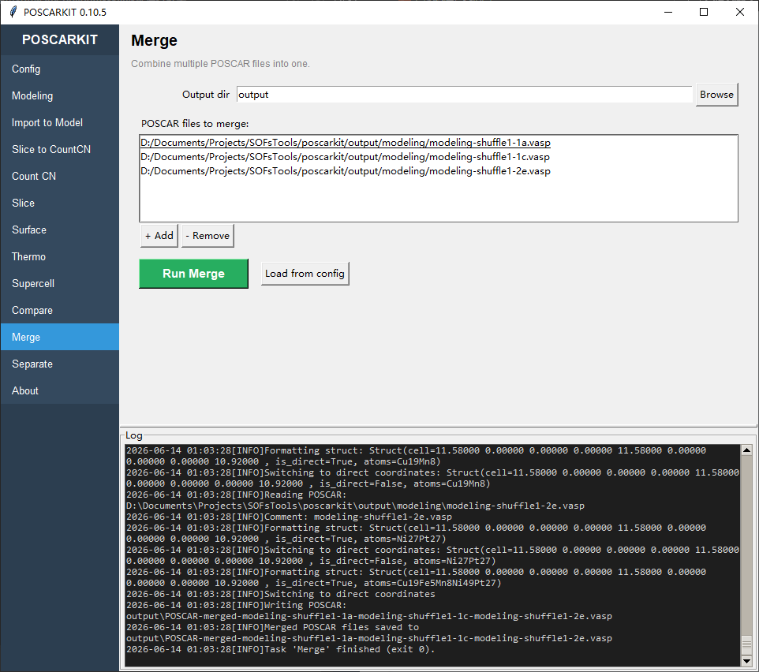

### 文件分离

分离功能将一份包含多种元素的POSCAR结构文件按用户指定的分组方式拆分为多个子文件。分组依据来自原子的亚晶格标识信息（生成建模时的位点标记）。用户选择一个POSCAR文件后，在"Group by"下拉框中选择分组依据（note为亚晶格位点标识、symbol为元素符号，或按x/y/z坐标方向分组）。软件按选定方式将原子分组，每组独立输出一份POSCAR文件。

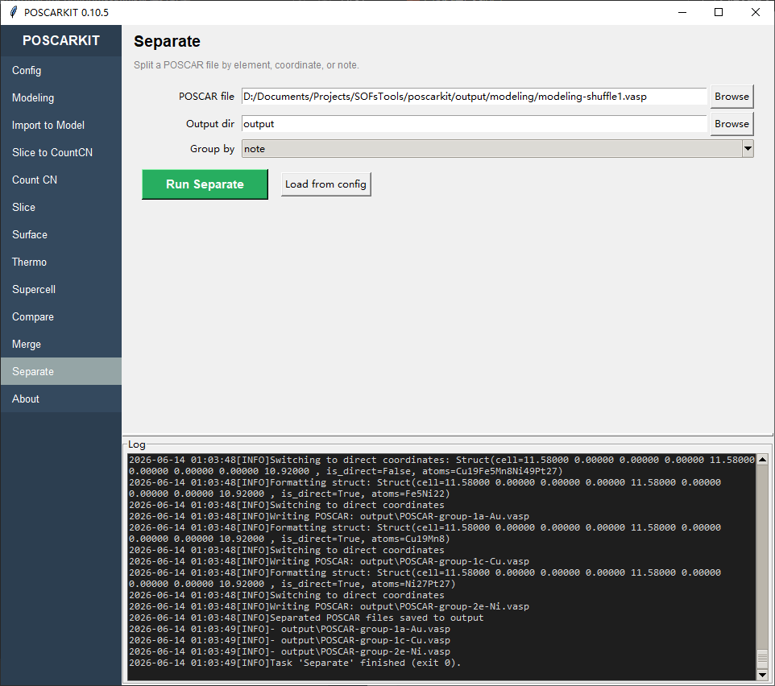

---

## 十、命令行模式

当程序启动时检测到命令行参数，进入命令行操作模式。命令行提供以下子命令，每个子命令的参数与图形界面对应功能一致：

`modeling` 从配置文件读取结构原型和SOF参数，生成超胞并执行原子分配。`countcn` 对POSCAR文件统计配位数并输出分析结果。`slice` 按指定米勒指数切分层结构。`slice-to-countcn` 先切片再逐层统计配位数。`supercell` 从POSCAR原胞直接扩胞。`compare` 比对两份POSCAR文件的差异。`merge` 合并两份POSCAR文件。`separate` 按亚晶格分组分离文件。`import-to-model` 从CSV或XLSX文件导入SOF数据并执行建模。`thermo` 读取SOF数据和TDB文件计算热力学量。`surface` 从体相POSCAR生成表面Slab。`help` 打印各子命令的参数说明。

通过 `python main.py <子命令>` 调用，或编译为独立可执行文件后直接运行。

配置文件的路径通过全局参数指定。如果命令行模式下未提供所需参数，程序输出错误提示并退出，返回对应退出码供调用脚本判断执行结果。所有子命令的输出文件保存到指定的输出目录，日志信息打印到标准输出。

---

## 十一、典型使用流程

以下描述一个从CALPHAD数据到结构分析结果的完整操作流程。

用户从Thermo-Calc导出BCC相在873°C下的占位分数数据文件。打开软件后，首先点击"Config"进入配置界面，确认BCC标签页中晶格矢量和亚晶格位点定义与目标体系一致，保存后关闭配置界面。

点击"Import to Model"进入导入建模界面。在"CSV/XLSX file"栏浏览选择占位分数数据文件，软件自动检测为Thermo-Calc格式并加载温度点列表。在"Temperatures"文本框输入873，输出模式选择"run"。点击执行后，软件读取该温度下的占位分数，注入BCC结构模板，按4×4×4超胞因子生成超胞并执行随机原子分配。日志区显示总原子数、各亚晶格分配明细和生成文件路径。

切换到"Count CN"功能，选择上一步生成的结构文件。保持"Cutoff multiplier"默认值1.1，勾选"Periodic boundary (PBC)"复选框。执行后的直方图显示第一近邻配位数集中在12附近，热力图展示了各元素对之间的配位偏好。如需进一步分析特定晶面的原子分布，使用"Slice"功能输入110方向的三个整数分量，观察各层原子数量和元素组成的变化。

如果研究涉及表面催化或吸附，使用"Surface"功能从生成的结构文件中构建Slab模型。选择110方向，保留6层原子，真空区设为15埃。输出的质量汇总表中低组成偏差和合理偶极矩值表明Slab模型质量可接受，可直接用于后续的VASP计算。

---

## 十二、常见问题解答

**Q1: 配位数结果明显偏高或偏低怎么办？**

调整"Cutoff multiplier"参数可改变截断距离的取值。增大该系数（如从1.1调至1.2）将截断距离向外扩展，捕捉更多近邻原子；减小系数（如从1.1调至1.0）则收缩截断距离。对于原子间距分布较宽的体系，适当增大系数有助于获得更合理的配位数结果。

**Q2: 导入SOF数据时提示格式无法识别？**

软件通过检测数据文件中的列名模式来判断格式。确认文件是Thermo-Calc（列名包含W、P、T、S等特征词）或Pandat（多Sheet 的Excel格式）的标准输出。如果文件经过了手动编辑修改了列名，可能导致检测失败。建议使用软件原始导出的文件。

**Q3: 表面Slab建模后组成偏离目标值较大？**

组成偏离通常意味着切割位置恰好落在了某元素富集层附近。尝试调整米勒指数方向或增减保留层数（N的取值），使切割平面避开高度富集区域。生成的质量汇总表中逐层组成信息可帮助判断偏离来源。

**Q4: 占位分数之和不等于1.0如何处理？**

在Config界面的可编辑表格中，每个亚晶格位点上各元素占位分数之和会自动校验。若文字显示红色，表明该位点的SOF总和偏离1.0。调整该位点下各元素的值使总和恢复至1.0，文字即变为绿色。

**Q5: 命令行模式如何获取帮助？**

执行 `python main.py help` 列出所有子命令，执行 `python main.py <子命令> --help` 查看该子命令的完整参数列表和说明。

---

## 十三、术语表

| 术语 | 英文 | 释义 |
|------|------|------|
| 亚晶格占位分数 | Sublattice Occupying Fraction (SOF) | 在特定亚晶格位点上各元素占据该位点的比例，所有元素比例之和为1 |
| 配位数 | Coordination Number (CN) | 某原子截断半径范围内的最近邻原子数量 |
| 特殊准随机结构 | Special Quasirandom Structure (SQS) | 通过优化对关联函数使有限超胞内原子排布逼近理想随机固溶体的结构 |
| 高熵合金 | High Entropy Alloy (HEA) | 由四种及以上主元素等摩尔或近等摩尔组成的合金 |
| POSCAR | POSCAR | VASP软件晶体结构输入文件格式，包含晶格矢量和原子坐标 |
| 超胞 | Supercell | 将原胞沿一个或多个晶格方向周期性复制扩展得到的大尺寸结构 |
| 米勒指数 | Miller Index | 用三个整数标记晶体中晶面的方向 |
| 表面平板模型 | Surface Slab | 沿晶体某方向切割并添加真空区得到的薄层结构，用于模拟材料表面 |
| 构型熵 | Configurational Entropy | 由固溶体中原子在晶格格点上不同排列方式贡献的熵 |
| TDB | Thermodynamic Database | CALPHAD方法使用的热力学数据库标准文本格式 |
| 选择性动力学 | Selective Dynamics | VASP POSCAR格式中用于标记各原子自由度（固定或弛豫）的约束标记 |
