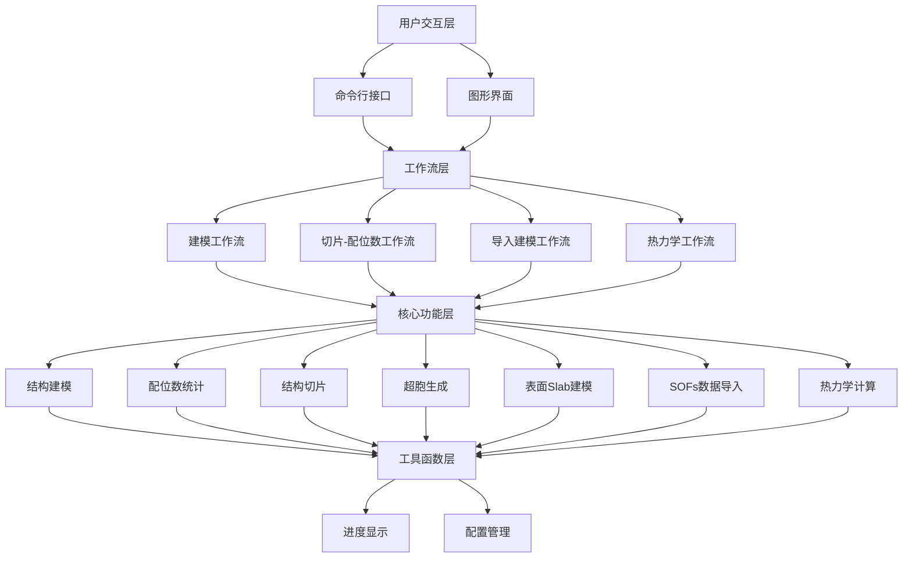

# POSCARKIT 基于占位分数的多元合金结构建模与分析软件 设计说明书

**版本号**：V0.10.5

**开发单位**：福州大学 材料科学与工程学院 材料基因工程组（MCMF）

**编制日期**：2026年6月11日

---

## 1 引言

### 1.1 编写目的

本文档描述POSCARKIT的系统架构、功能模块划分和核心算法设计，为软件著作权登记提供技术文档支持，同时为后续开发和维护提供依据。面向开发人员、测试工程师及项目维护人员。

### 1.2 项目背景

在高熵合金（HEA）等复杂材料的第一性原理计算中，研究人员需要在超胞中按亚晶格占位分数（SOFs）分配原子，并统计配位数（CN）、沿晶面切片。现有工具（ASE、SQSgenerator、VASPKIT）各司其职但缺乏整合。POSCARKIT 整合超胞生成、SOFs原子分配（Shuffle/SQS两种模式）、配位数统计、结构切片、表面Slab建模、热力学分析及POSCAR文件操作等功能，通过配置文件驱动的统一工作流，显著提升材料计算研究效率。

### 1.3 术语定义

| 术语 | 定义 |
|------|------|
| SOF | Sublattice Occupying Fraction，亚晶格占位分数 |
| CN | Coordination Number，配位数 |
| SQS | Special Quasirandom Structure，特殊准随机结构 |
| HEA | High Entropy Alloy，高熵合金 |
| POSCAR | VASP软件晶体结构文件格式 |
| Supercell | 超胞，原胞周期性扩展得到的大尺寸结构 |
| Miller Index | 晶面指数 |
| TDB | Thermodynamic Database，CALPHAD热力学数据库格式 |
| Slab | 表面平板模型，用于模拟材料表面 |

---

## 2 总体设计

### 2.1 设计目标

1. **功能完整性**：覆盖超胞生成→SOFs原子分配→配位数统计→结构切片→表面Slab建模→热力学分析的完整分析流程。
2. **操作便捷性**：提供图形界面和命令行两种操作模式，图形界面为默认入口，命令行支持批量处理和脚本集成。
3. **数据互操作性**：支持从主流CALPHAD软件输出中自动识别格式并导入SOFs数据，打通热力学计算到结构建模的数据链路。
4. **热力学分析能力**：内建TDB数据库解析和构型熵/Gibbs自由能计算引擎，无需依赖外部热力学软件。
5. **可扩展性**：通过配置文件驱动——预设FCC/BCC/HCP结构原型并支持自定义任意晶体结构，新增相类型无需修改代码。
6. **性能优化**：采用空间索引和并行计算策略，支持数万原子规模的高效处理。
7. **结果可视化**：自动生成配位数分布直方图、热力图、结构切片投影图及热力学分析图。
8. **格式兼容性**：严格遵循VASP POSCAR格式标准，支持选择性动力学约束（Selective Dynamics），确保与VASP等第一性原理计算软件无缝对接。

### 2.2 软件整体架构

采用分层架构设计，自上而下分为五层：

- **用户交互层**：负责请求接收、参数采集和功能分发。提供图形界面（GUI）和命令行（CLI）两种入口，共享同一套功能执行逻辑。
- **工作流层**：封装多步骤操作的编排逻辑，将独立的核心功能组合为端到端的分析流程，不包含领域逻辑。
- **核心功能层**：实现全部领域算法和核心数据结构，是系统的逻辑主体。各功能模块相对独立，仅依赖基础数据结构。
- **工具函数层**：提供进度反馈、配置管理等通用基础设施，被上层各模块调用。

层间单向依赖：上层可调用下层接口，下层不感知上层存在。数据以领域对象形式在层间传递，文件I/O仅发生在系统边界。

### 2.3 运行环境

| 类别 | 要求 |
|------|------|
| 操作系统 | Windows 10/11 64位、Linux 64位 |
| 运行环境 | Python ≥3.10 |
| 关键依赖 | 数值计算（NumPy、SciPy）、数据处理（Pandas、openpyxl）、可视化（Matplotlib、seaborn）、材料科学（ASE）、进度反馈（tqdm）、SQS优化（sqsgenerator）、图形界面（Tkinter，Python标准库） |
| 硬件 | 双核CPU / 4GB内存 / 500MB硬盘（推荐四核 / 8GB+） |

### 2.4 开发环境

开发语言Python 3.10+，版本控制Git，构建系统setuptools，支持编译为独立可执行文件，测试框架unittest，开源许可MIT。

---

## 3 功能模块详细设计

### 3.1 用户交互模块

提供两种操作模式以适应不同使用场景：

- **图形界面模式**：程序默认入口（无命令行参数时启动）。采用左右分栏布局——左侧为功能导航区，按功能类别组织入口；右侧为动态参数表单区，根据所选功能切换对应的参数采集界面。表单支持多种输入控件（文本、文件浏览、下拉选择、复选框、可编辑表格），参数默认值从配置文件预填。底部设实时日志输出区，任务在后台异步执行，界面保持响应。提供配置参数的保存与加载能力。

- **命令行模式**：通过参数化的子命令直接执行，覆盖全部功能（建模、配位数统计、切片、切片+配位数、超胞生成、文件比较、文件合并、文件分离、导入建模、热力学分析、表面Slab生成、帮助）。适用于脚本集成和批量处理场景。

两种模式通过同一套功能执行逻辑确保行为一致性。

### 3.2 结构建模模块

本模块是系统的核心，负责晶体结构的表示、生成和原子分配。

**基础数据结构**：定义原子和晶体结构两类核心抽象。原子封装元素符号、三维坐标、选择性动力学约束标记和亚晶格标识。晶体结构封装晶格矩阵（3×3）、坐标类型（分数坐标/笛卡尔坐标）和原子集合，支持遍历、排序、分组、去重等集合操作。结构的序列化遵循VASP POSCAR格式规范，同时提供与ASE原子模拟环境的数据双向转换。自定义元数据在转换过程中保持完整性。

**超胞生成**：原胞沿三个晶格方向周期性扩展。通过分数坐标广播法生成超胞所有原子位置，新晶格矩阵为原胞矩阵的对角缩放。支持从预设结构原型自动构建原胞（FCC/BCC/HCP），也可从外部POSCAR文件读取任意原胞。提供手动实现和外部库两种后端，可切换。

**原子分配引擎**：实现高熵合金建模的核心——SOF到具体原子排布的转换。首先将各亚晶格位点的SOF小数按位点多重度和超胞尺寸转换为整数原子数量（含舍入调整算法确保总数匹配），然后在超胞中对各位点位置随机排序并按序分配元素符号。支持两种分配策略：
- **随机分配**：基于随机种子对各亚晶格独立洗牌分配，可批量生成多组种子对应的结构。
- **准随机结构（SQS）**：对各亚晶格独立优化对关联函数，使有限超胞内的原子排布逼近理想随机固溶体的统计特性，然后合并各亚晶格结果。

批量处理采用进程池并行加速。分配过程的SOF到整数转换明细可输出为日志。

### 3.3 配位数统计模块

对晶体结构中的原子进行近邻搜索和配位数统计。核心设计要点：

- **截断距离自动检测**：通过分析原子对距离统计分布的差分梯度，自动定位第一近邻与第二近邻的分界，免去人工设定截断半径。大规模结构支持先采样再分析以控制计算开销，采样过程支持随机种子以确保可复现。
- **快速近邻搜索**：采用三维空间划分树索引结构，将暴力搜索的 O(N²) 降至 O(N log N)。
- **周期性边界条件**：支持PBC模式，使用最小镜像约定计算原子对距离，适用于小超胞或单胞场景。
- **双后端设计**：支持基于空间索引的自定义实现和基于ASE自然半径的方案，可切换。

输出维度：(1) 按配位数分组的POSCAR结构文件；(2) 累积配位数（CN≥n）的POSCAR结构文件；(3) 统计CSV表（含计数和累积列）；(4) 分面和堆叠两类直方图；(5) 元素对平均配位数热力图。

### 3.4 结构切片模块

沿指定晶面方向将三维结构切分为独立的二维原子层。核心处理流程：

1. **基底构造**：根据Miller指数确定切片方向的正交基底组。常用方向预定义基底映射，任意方向通过向量叉乘法构造。
2. **坐标变换**：沿基底方向重构坐标系，使法线方向对齐新z轴。
3. **层分组**：按原子在法线方向上的投影距离进行精度可调的取整分组，跨周期性边界的同层原子自动合并。

每层独立输出POSCAR结构文件、面内原子投影图（含标尺）和原子坐标数据表。

### 3.5 表面Slab建模模块

从体相结构生成非对称表面Slab模型，服务于表面科学的第一性原理计算。核心处理流程：

1. **坐标变换**：按Miller指数构造新基底组使法线方向对齐z轴，通过晶体学坐标变换重构晶格。
2. **原子层识别**：采用取整投影法——各原子分数z坐标按指定精度取整分组，跨周期性边界同层自动合并。
3. **间隙检测**：计算相邻原子层z质心之间的中点作为切割平面，考虑周期性边界跨接。
4. **坐标展开**：从切割平面向下对各层原子分数z坐标进行去周期化展开，消除周期性跳跃，获得连续单调坐标序列。
5. **Slab组装**：选取指定层数（N和N+1）的原子层，构建正交化晶格（面内矢量不变，法线矢量按Slab厚度+真空区重缩放），底部和顶部分配真空区。
6. **选择性动力学约束**：默认固定底部半数原子层，顶部保持自由。支持完全固定（F F F）和仅固定法线方向（T T F）两种模式，固定层数可手动指定。
7. **质量指标**：自动计算并输出组成偏差、偶极矩、表面能估算值、顶层平整度等质量评估指标。

### 3.6 SOFs数据导入与热力学分析模块

**SOFs数据导入**：实现从CALPHAD软件输出中自动提取亚晶格占位分数。支持多种上游格式的自动识别（通过列名模式匹配），统一转换为内部中间表示，包含相信息、亚晶格比例、温度依赖的占位分数序列和名义组成。提供温度点SOFs插值提取（精确匹配或最近邻）和CALPHAD亚晶格编号到晶体学Wyckoff位点名称的映射。导入数据可直接注入结构模板或驱动建模工作流。

**TDB解析器**：自包含的热力学数据库格式解析器，不依赖外部热力学软件。按记录分隔符和注释标记解析文本，提取温度依赖函数、端元Gibbs自由能参数和各相亚晶格化学计量比。通过函数引用展开获得可直接数值求值的纯温度变量表达式。

**构型熵计算**：实现通用N亚晶格公式，支持任意亚晶格数的相。同时提供随机混合假设下的简化计算。

**Gibbs自由能计算**：采用端元加权平均法——遍历所有可能的端元元素组合，以名义组成的乘积为权重对端元Gibbs自由能求和，加上温度-熵贡献项。表达式求值采用受控数值求值环境，仅暴露必要的数学函数。

**结果可视化**：生成双面板对比图——左面板为构型熵-温度曲线（实际SOFs与随机混合假设对比），右面板为Gibbs自由能-温度曲线。

### 3.7 工作流模块

编排多步骤操作，提供四个预定义分析流程：

- **建模工作流**：串联超胞生成→原子分配（随机或SQS）→约束标记。可输出SOF到整数转换明细。
- **切片-配位数工作流**：串联结构切片→逐层配位数统计→层内元素对CN标注。
- **导入建模工作流**：串联SOFs数据读取（自动格式检测）→亚晶格映射→结构信息构建→原胞生成→建模工作流。支持三种输出模式：直接运行建模、保存为配置片段、打印数据摘要。
- **热力学工作流**：串联数据读取→TDB解析→亚晶格比例修正→构型熵计算→Gibbs自由能计算→图表输出。

工作流层不包含领域逻辑，仅负责模块实例化和调用编排。

### 3.8 工具函数模块

提供统一的进度反馈接口，支持固定长度和可变长度迭代器两种模式。所有涉及循环处理的核心模块统一调用此接口，确保长时间运行任务有实时进度反馈。

---

## 4 核心算法设计

### 4.1 超胞生成算法

#### 4.1.1 算法原理

给定原胞晶格矩阵 $\mathbf{C} \in \mathbb{R}^{3\times3}$、$N$ 个原子的分数坐标 $\{ \mathbf{x}_k \in [0, 1)^3 \}_{k=1}^{N}$ 和超胞因子 $(n_x, n_y, n_z)$，超胞中原子数为 $N \cdot n_x n_y n_z$。

通过广播方式生成新原子的分数坐标：

$$ \mathbf{x}_{k,ijk} = \frac{\mathbf{x}_k + (i, j, k)}{(n_x, n_y, n_z)} \mod 1.0 $$

其中 $i \in \{0, \dots, n_x-1\}$，$j \in \{0, \dots, n_y-1\}$，$k \in \{0, \dots, n_z-1\}$。

新晶格矩阵为：

$$ \mathbf{C}_{super} = \mathbf{C} \cdot \begin{bmatrix} n_x & 0 & 0 \\ 0 & n_y & 0 \\ 0 & 0 & n_z \end{bmatrix} $$

#### 4.1.2 处理流程

1. 获取原胞的分数坐标矩阵
2. 生成三维索引网格，覆盖所有格点偏移量
3. 将原胞坐标与索引广播相加后除以对应的超胞因子
4. 对分数坐标取模，确保结果在 $[0,1)$ 区间
5. 计算新晶格矩阵并清理浮点误差
6. 组装超胞结构，继承原子属性和亚晶格标记

### 4.2 截断距离自动检测算法

#### 4.2.1 算法原理

配位数定义为在截断半径 $r_{cut}$ 内，中心原子 $i$ 的近邻原子数量：

$$ CN_i = \sum_{j \neq i} \mathbb{1}(\|\mathbf{r}_i - \mathbf{r}_j\|_2 \leq r_{cut}) $$

截断半径的自动确定基于距离分布的差分分析。对原子间距离排序后计算差分序列 $\Delta_k = d_{(k+1)} - d_{(k)}$。在晶体中，第一近邻和第二近邻之间存在明显的距离间隙，对应差分值的突变。以差分序列均值加标准差作为突变检测阈值，首个超过阈值的差分位置即对应第一近邻与第二近邻的分界距离。

最终截断半径为：$r_{cut} = d_{cutoff} \cdot m_{cut}$，其中 $m_{cut}$ 为用户指定的容差倍数。

#### 4.2.2 处理流程

1. 获取所有原子的笛卡尔坐标
2. 大规模结构随机采样以控制计算开销
3. 计算所有采样原子对的距离并排序
4. 过滤过小距离（排除同位置或重叠原子）
5. 取距离分布前段子集，计算差分序列
6. 以差分均值和标准差之和作为突变检测阈值
7. 定位首个差分突变点，确定截断距离
8. 若未检测到突变，取子集分位数作为保守估计

### 4.3 基于空间索引的快速配位数搜索

#### 4.3.1 算法原理

大规模超胞（数万至数十万原子）的暴力近邻搜索代价不可接受。采用三维空间划分树（k-d tree）进行加速。构建阶段对所有原子坐标建立空间索引（时间复杂度 $O(N\log N)$）；查询阶段对每个中心原子在截断半径内检索近邻（时间复杂度 $O(\log N + M)$，$M$ 为近邻数）。总时间复杂度降至 $O(N\log N + N \cdot \bar{M})$。

#### 4.3.2 处理流程

1. 提取所有原子的笛卡尔坐标构建空间索引树
2. 对每个原子执行半径查询，获取候选近邻索引
3. 过滤候选集中的自身匹配和超截断原子
4. 按近邻元素符号分组计数，统计各元素对的配位数
5. 汇总所有原子的配位数数据和原子对频次

### 4.4 结构切片算法

#### 4.4.1 算法原理

给定晶面指数 $\mathbf{n} = (h, k, l)$，切片算法的关键是确定面内正交基底组 $\{\mathbf{b}_1, \mathbf{b}_2, \mathbf{n}\}$。

常用晶面方向预定义最优基底（如 (001) 对应标准坐标轴基底），任意方向通过向量叉乘法构造：选取不平行于 $\mathbf{n}$ 的试探向量 $\mathbf{t}_0$，依次计算 $\mathbf{b}_1 = \mathbf{n} \times \mathbf{t}_0$、$\mathbf{b}_2 = \mathbf{n} \times \mathbf{b}_1$，得到正交基底组。

沿基底方向进行坐标变换后，各原子在法线方向 $\mathbf{n}$ 上的投影值即标识其所属的原子层。按投影值取整分组即完成层切分。

#### 4.4.2 处理流程

1. 根据晶面指数确定基底矢量组并归一化
2. 沿基底方向对结构进行坐标变换
3. 计算各原子在法线方向的投影距离
4. 按投影距离取整分组，合并周期性边界同层原子
5. 每层分别生成POSCAR结构文件、面内投影图和坐标数据表

### 4.5 准随机结构（SQS）生成

#### 4.5.1 算法原理

SQS方法通过优化有限超胞内的原子排布，使若干近邻壳层的对关联函数逼近理想随机固溶体的对应值。本系统采用逐亚晶格独立优化的策略：对每个亚晶格位点分别生成SQS结构，然后将各亚晶格结果合并为完整结构。优化过程复用外部SQS求解器。

#### 4.5.2 处理流程

1. 按亚晶格位点分离原胞子结构
2. 对每个子结构构建优化问题：晶格矩阵、坐标、元素种类、超胞尺寸、目标组分
3. 调用SQS求解器进行对关联函数优化
4. 提取最优结构并转换为内部表示
5. 合并所有亚晶格子结构，保留各位点的元素排布

### 4.6 表面Slab生成算法

#### 4.6.1 算法原理

给定体相结构和Miller指数 $\mathbf{n}=(h,k,l)$，表面Slab的生成包含四个核心阶段：

**坐标变换**：构造使法线方向对齐z轴的新基底组。常用方向使用预定义最优基底，任意方向通过试探向量叉乘法构造 $\{\mathbf{b}_1, \mathbf{b}_2, \mathbf{n}\}$，沿新基底重构晶格使法线方向对齐新的z轴。

**原子层识别**：将变换后各原子的分数z坐标按指定精度 $p$ 取整，相同取整值的原子归为同一层。跨周期性边界条件（$z\approx0$ 和 $z\approx1$ 对应同一物理层）的层自动检测并合并。

**间隙计算**：按展开后的z质心升序排列各层。相邻层质心中点构成切割平面（gap），第 $n-1$ 层与第 $0$ 层之间的周期性跨越中点需加1.0处理。

**去周期化展开**：从切割平面出发，对选定层数的原子分数z坐标进行去周期化处理——将高于切割面的原子偏移-1，然后按z降序排列并逐次追加-1偏移以消除周期性跳跃。展开后的坐标转换为笛卡尔坐标，构建新晶格：面内矢量 $\mathbf{a},\mathbf{b}$ 不变，法线矢量 $\mathbf{c}$ 按Slab厚度加真空区重新标定。

#### 4.6.2 处理流程

1. 按Miller指数变换体相晶格坐标系
2. 分数z坐标取整分组，识别独立原子层
3. 合并周期性边界层，计算各层z质心
4. 计算层间间隙（切割平面）位置
5. 验证请求层数不超过可用层数
6. 过滤间隙（确保下方有足够层数供选取）
7. 对每个有效间隙：向下选取N和N+1层原子
8. 展开分数z坐标（去周期化处理）
9. 转换为笛卡尔坐标，构建含真空区的新晶格
10. 平移使底部原子对齐真空下边界
11. 应用选择性动力学约束（完全固定或仅固定法线方向）
12. 计算质量评估指标，输出汇总表

---

## 5 数据结构设计

| 数据结构 | 用途 | 设计要点 |
|----------|------|----------|
| 原子 | 存储单个原子的完整信息 | 序号、元素符号、三维坐标（分数或笛卡尔）、选择性动力学约束标记、亚晶格标识、扩展元数据 |
| 晶体结构 | 封装晶格和原子集合 | 3×3晶格矩阵、坐标类型标记、原子有序集合；支持遍历、排序、分组、去重、坐标类型转换 |
| 配位数数据 | 存储单个原子的近邻统计 | 中心-近邻元素对标识、中心原子引用、近邻原子列表、配位数值 |
| 原子层 | 表面Slab中的独立原子层 | 层序号、法线方向质心坐标、原子列表、元素组成标识 |
| SOFs中间表示 | 导入数据的统一内部格式 | 源文件标识、相名称、亚晶格化学计量比、温度序列、各亚晶格占位分数数组、名义组成、元素列表 |
| 配置对象 | 运行参数的集合 | 任务标识、输入输出路径、结构相、超胞因子、切片方向、随机种子、批处理参数、算法选择等 |
| TDB数据库 | 热力学数据库内存表示 | 温度依赖函数字典、端元参数映射表、各相亚晶格化学计量比 |
| 元素颜色映射 | 元素到可视化颜色的对应 | 覆盖Li到Re共27种过渡金属和常见合金元素的标准色码 |
| 晶面基底映射 | Miller指数到正交基底的对应 | 预设(001)、(110)、(111)三种常用方向的基底矢量组 |

---

## 6 运行设计

### 6.1 启动流程

程序启动时判断命令行参数：有参数则进入命令行模式（解析→校验→执行→退出）；无参数则启动图形界面。两种模式共享同一套功能执行逻辑。

### 6.2 模块间交互

遵循分层单向调用原则：用户交互层接收请求后分发给工作流层，工作流层实例化核心模块并编排调用顺序，核心模块在执行过程中调用工具函数获取通用服务。数据在各层之间以领域对象形式传递，文件读写仅发生于系统边界。

外部库承担特定支撑角色：材料模拟库提供结构变换，科学计算库提供空间索引和距离计算，优化库提供SQS求解。

### 6.3 事件处理

- **输入事件**：参数验证失败时提示重试；SOFs总和偏离1.0时触发归一化确认。
- **错误事件**：文件或参数错误输出明确信息并返回非零退出码；计算异常输出完整调用栈。
- **完成事件**：执行完成后输出结果摘要（生成文件列表及路径）。

---

## 7 出错处理设计

主要错误类型：文件不存在或格式错误、参数缺失或类型/范围无效、数值计算误差（浮点精度、重复原子）、SQS收敛失败、内存不足、用户中断。处理机制：三级退出码（0正常/1一般错误/130用户中断）+日志分级（INFO/WARNING/ERROR）。图形界面下错误信息显示于日志区并恢复界面响应，命令行下输出错误信息并退出。

---

## 8 系统维护设计

### 8.1 模块化设计

系统划分为多个功能模块，层间单向依赖，无循环引用。基础数据结构模块处于最底层，定义原子和晶体结构两个核心抽象；算法模块（超胞生成、原子分配、配位数统计、结构切片、表面Slab建模）分处平行位置，各自仅依赖基础数据结构；数据导入和热力学计算模块提供跨领域数据互通；工作流模块负责编排；用户交互模块独立于业务逻辑。任一模块的修改不影响其他模块功能，仅需保持模块间接口不变。

### 8.2 可扩展性

- **新结构原型**：在配置文件中按约定格式添加，无需修改代码。相名称大小写不敏感。
- **新功能命令**：在命令行解析器中注册子命令，在图形界面中注册对应的参数表单。
- **新算法后端**：超胞生成和配位数统计设计为可切换多种后端实现，新增后端遵循统一接口即可接入。
- **新数据格式**：SOFs导入模块采用格式检测-阅读器注册模式，新增上游格式只需添加对应的阅读器。
- **参数来源**：配置文件、图形界面表单、命令行参数构成多级参数体系，适应不同运行场景。

### 8.3 测试方案

采用unittest测试框架，测试覆盖全部核心模块和工作流，包括：命令行接口、文件读写与格式验证、超胞生成正确性、截断距离检测与CN计算验证、基底计算与层分组、表面Slab生成各阶段、端到端建模流程、端到端切片-CN流程、SOFs数据导入与IR转换、热力学TDB解析与表达式求值、GUI参数解析逻辑、工具函数。通过 `python -m unittest discover tests` 运行全部测试。

---

## 9 附录

### 9.1 参考文献

1. Wu B.\*, Zhao Y.\*, Ali H., et al. A reasonable approach to describe the atom distributions and configurational entropy in high entropy alloys based on site preference. *Intermetallics*, 144 (2022), 107489.
2. 《软件工程导论（第6版）》，张海藩，清华大学出版社.
3. Zunger, A., Wei, S. H., Ferreira, L. G., & Bernard, J. E. (1990). Special quasirandom structures. *Physical Review Letters*, 65(3), 353–356.
4. Kresse, G., & Furthmüller, J. (1996). Efficient iterative schemes for ab initio total-energy calculations using a plane-wave basis set. *Physical Review B*, 54(16), 11169–11186.
5. Hjorth Larsen, A., et al. (2017). The Atomic Simulation Environment—A Python library for working with atoms. *Journal of Physics: Condensed Matter*, 29(27), 273002.
6. Virtanen, P., et al. (2020). SciPy 1.0: Fundamental Algorithms for Scientific Computing in Python. *Nature Methods*, 17(3), 261–272.
7. Harris, C. R., et al. (2020). Array programming with NumPy. *Nature*, 585(7825), 357–362.
8. Hunter, J. D. (2007). Matplotlib: A 2D Graphics Environment. *Computing in Science & Engineering*, 9(3), 90–95.
9. McKinney, W. (2010). Data Structures for Statistical Computing in Python. *Proceedings of the 9th Python in Science Conference*, 51–56.
10. Waskom, M. L. (2021). seaborn: statistical data visualization. *Journal of Open Source Software*, 6(60), 3021.
11. Bentley, J. L. (1975). Multidimensional binary search trees used for associative searching. *Communications of the ACM*, 18(9), 509–517.
