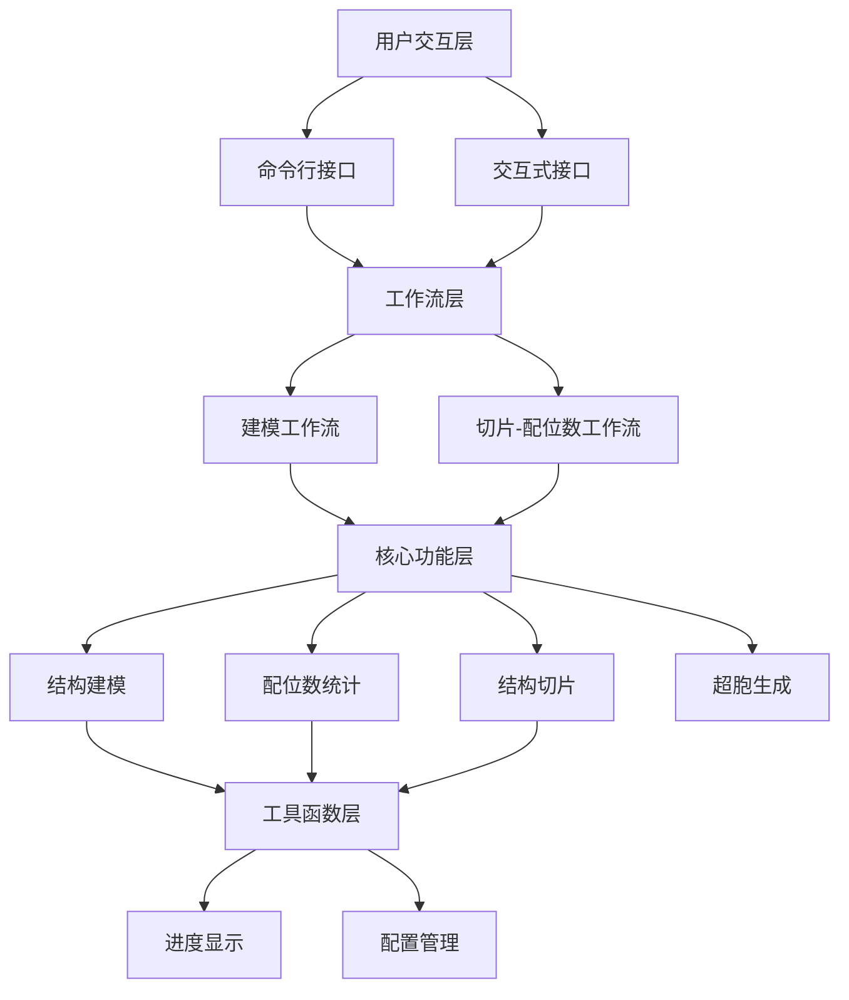

# POSCARKIT 晶体结构建模与分析软件 设计说明书

**版本号**：V0.9.2

**编制日期**：2026年3月9日

**编制单位**：福州大学 材料科学与工程学院 材料基因工程组（MCMF）

---

## 1 引言

### 1.1 编写目的

本文档描述POSCARKIT的系统架构、功能模块和核心算法设计，为软件著作权登记提供技术文档支持，同时为后续开发和维护提供依据。面向开发人员、测试工程师及项目维护人员。

### 1.2 项目背景

在高熵合金（HEA）等复杂材料的第一性原理计算中，研究人员需要在超胞中按亚晶格占位分数（SOFs）分配原子，并统计配位数（CN）、沿晶面切片。现有工具（ASE、SQSgenerator、VASPKIT）各司其职但缺乏整合，研究者需自行编写零散脚本。POSCARKIT 整合超胞生成、SOFs原子分配（Shuffle/SQS两种模式）、配位数统计、结构切片及POSCAR文件操作等核心功能，通过配置文件驱动的统一工作流，显著提升材料计算研究效率。

### 1.3 术语定义

| 术语 | 定义 |
|------|------|
| SOF | Sublattice Occupying Fraction，亚晶格占位分数 |
| CN | Coordination Number，配位数 |
| SQS | Special Quasirandom Structure，特殊准随机结构 |
| HEA | High Entropy Alloy，高熵合金 |
| POSCAR | VASP软件晶体结构文件格式 |
| Supercell | 超胞，原胞周期性扩展得到的大尺寸结构 |
| Miller Index | 晶面指数 |

---

## 2 总体设计

### 2.1 设计目标

1. **功能完整性**：覆盖超胞生成→SOFs原子分配→配位数统计→结构切片的完整分析流程。
2. **操作便捷性**：命令行（CLI）和交互式两种操作模式，适应批量处理和逐步引导场景。
3. **可扩展性**：支持FCC/BCC/HCP预设结构原型，可通过配置文件自定义任意晶体结构。
4. **性能优化**：采用空间索引和并行计算策略，支持数万原子规模的高效处理。
5. **结果可视化**：自动生成配位数分布直方图、热力图及结构切片平面投影图。
6. **格式兼容性**：严格遵循VASP POSCAR格式标准，确保与其他材料计算软件无缝对接。

### 2.2 软件整体架构

采用四层分层架构：

- **用户交互层**：提供命令行解析和交互式菜单两种入口，负责请求接收、参数校验和功能分发。
- **工作流层**：封装多步骤操作的编排逻辑，将核心功能组合为端到端的分析流程。
- **核心功能层**：实现领域算法和数据结构，包括结构表示与读写、超胞生成、原子分配、配位数统计和结构切片。
- **工具函数层**：提供进度反馈、配置管理等通用基础设施。

层间单向依赖，上层调用下层接口，下层不感知上层。数据通过领域对象在层间传递，文件读写仅发生在系统边界。

### 2.3 运行环境

| 类别 | 要求 |
|------|------|
| 操作系统 | Windows 10/11 64位、Linux 64位 |
| 运行环境 | Python >=3.10 |
| 关键依赖 | 数值计算库（NumPy、SciPy）、数据处理库（Pandas、openpyxl）、可视化库（Matplotlib、seaborn）、材料科学库（ASE）、进度条库（tqdm）、SQS优化库（sqsgenerator） |
| 硬件 | 双核CPU / 4GB内存 / 500MB硬盘（推荐四核 / 8GB+） |

### 2.4 开发环境

开发语言Python 3.10+。版本控制Git。构建通过setuptools，支持Nuitka编译为独立可执行文件。测试框架pytest/unittest。开源许可MIT。

---

## 3 功能模块详细设计

### 3.1 用户交互模块

提供两种操作模式以适应不同使用场景：

- **命令行模式**：支持8个子命令（建模、配位数统计、切片、切片+配位数、超胞生成、文件比较、文件合并、文件分离），通过参数解析直接执行并返回结果。
- **交互式模式**：无命令行参数时自动进入，以菜单引导方式逐项收集用户输入，每项输入即时验证，支持循环操作。

两种模式共享同一套功能分发逻辑，确保行为一致。

### 3.2 结构建模模块

本模块是系统的核心，包含三个子领域：

**基础数据结构**：设计原子和晶体结构两类核心抽象。原子包含序号、元素符号、三维坐标、约束标记和亚晶格标识。晶体结构封装晶格矩阵、坐标类型（分数/笛卡尔）和原子集合，支持列表式遍历、排序、分组、去重等操作。结构的输入输出遵循VASP POSCAR格式规范，同时提供与ASE库的双向转换。

**超胞生成**：原胞沿三个晶格方向周期性扩展。通过分数坐标广播法生成超胞所有原子的坐标，新晶格矩阵为原胞矩阵对角缩放。支持三种预设结构原型（FCC/BCC/HCP）的原胞自动构建，也可从POSCAR文件读取任意原胞。

**原子分配引擎**：这是实现高熵合金建模的核心。首先将各亚晶格位点的SOF小数按照位点多重度和超胞因子转换为整数原子数量，然后在超胞中对各位点的原子随机排序并按序分配元素符号。分配前若SOFs总和偏离1.0则提示归一化确认。支持两种策略：
- **随机分配**：基于随机种子对各位点独立洗牌分配，可批量生成多组随机种子对应的结构。
- **准随机结构（SQS）**：对各亚晶格位点分别优化对关联函数，使有限超胞内的原子排布尽可能逼近理想随机固溶体的统计特性，然后合并各亚晶格结果。

批量处理采用进程池并行，以加速多组随机种子的独立建模。

### 3.3 配位数统计模块

对晶体结构中的原子进行近邻搜索和配位数统计。核心设计要点：

- **截断距离自动检测**：通过分析原子对距离的统计分布——计算距离差分梯度，定位第一近邻与第二近邻的边界——自动确定合理的截断阈值，免去人工设定。大规模结构先采样再分析以降低计算成本。
- **快速近邻搜索**：采用空间划分树索引结构，将暴力搜索的 $O(N^2)$ 降至 $O(N\log N)$。搜索半径附加容差以提高稳健性。
- **备选计算方法**：同时支持基于原子自然半径的截断方案，供用户按需切换。

输出维度：(1) 按配位数分组的POSCAR结构文件，便于后续分析特定配位数层；(2) 配位数统计CSV表；(3) 分面和堆叠两类直方图；(4) 元素对平均配位数热力图。

### 3.4 结构切片模块

沿指定晶面方向将三维结构切分为独立的二维原子层。处理流程：

1. **基底计算**：根据晶面指数确定切片方向的正交基底组。常用方向（(001)/(110)/(111)）预定义基底映射，任意方向采用试探向量叉乘法构造。
2. **坐标变换**：利用ASE库沿基底方向重构坐标系，使法线方向对齐新的z轴。
3. **层分组**：按原子在法线方向上的投影距离分组，精度可调。

每层独立输出POSCAR文件、面内结构投影图和原子坐标表。

### 3.5 工作流模块

编排多步骤操作，提供两个预定义流程：

- **建模工作流**：串联超胞生成 → 原子分配（随机或SQS）→ 轴向约束标记。
- **切片-配位数工作流**：串联结构切片 → 逐层配位数统计 → 层内元素对CN关系标注。

工作流层不包含领域逻辑，仅负责核心模块的实例化和调用编排。

### 3.6 工具函数模块

提供进度条封装，支持固定长度和可变长度迭代器两种模式，以及上下文管理器语法。所有涉及循环处理的核心模块统一调用此接口，确保长时间运行任务有实时进度反馈。

---

## 4 核心算法设计

### 4.1 超胞生成算法

#### 4.1.1 算法原理

给定原胞晶格矩阵 $\mathbf{C} \in \mathbb{R}^{3\times3}$、$N$ 个原子的分数坐标 $\{ \mathbf{x}_k \in [0, 1)^3 \}_{k=1}^{N}$ 和超胞因子 $(n_x, n_y, n_z)$，超胞中原子数为 $N \cdot n_x n_y n_z$。

通过广播方式生成新原子的分数坐标：

$$ \mathbf{x}_{k,ijk} = \frac{\mathbf{x}_k + (i, j, k)}{(n_x, n_y, n_z)} \mod 1.0 $$

其中 $i \in \{0, \dots, n_x-1\}$，$j \in \{0, \dots, n_y-1\}$，$k \in \{0, \dots, n_z-1\}$。

新晶格矩阵为：

$$ \mathbf{C}_{super} = \mathbf{C} \cdot \begin{bmatrix} n_x & 0 & 0 \\ 0 & n_y & 0 \\ 0 & 0 & n_z \end{bmatrix} $$

#### 4.1.2 处理流程

1. 获取原胞的分数坐标矩阵
2. 生成三维索引网格，覆盖所有格点偏移量
3. 将原胞坐标与索引广播相加后除以对应的超胞因子
4. 对分数坐标取模，确保结果在 $[0,1)$ 区间
5. 计算新晶格矩阵并清理浮点误差
6. 组装超胞结构，继承原子属性和亚晶格标记

### 4.2 截断距离自动检测算法

#### 4.2.1 算法原理

配位数定义为在截断半径 $r_{cut}$ 内，中心原子 $i$ 的近邻原子数量：

$$ CN_i = \sum_{j \neq i} \mathbb{1}(\|\mathbf{r}_i - \mathbf{r}_j\|_2 \leq r_{cut}) $$

截断半径的自动确定基于距离分布的差分分析。对原子间距离排序后计算差分序列 $\Delta_k = d_{(k+1)} - d_{(k)}$。在理想晶体中，第一近邻和第二近邻之间存在明显的距离间隙，对应的差分值会出现突变。以差分序列均值加标准差作为突变阈值，首个超过阈值的差分位置即对应第一近邻与第二近邻的分界距离。

最终截断半径为用户指定倍数与自动检测分界距离的乘积：$r_{cut} = d_{cutoff} \cdot m_{cut}$。

#### 4.2.2 处理流程

1. 获取所有原子的笛卡尔坐标
2. 大规模结构随机采样以控制计算开销
3. 计算所有采样原子对的距离并排序
4. 过滤过小距离（排除同位置或重叠原子）
5. 取距离分布的前段子集，计算差分序列
6. 以差分均值和标准差之和作为突变检测阈值
7. 定位首个差分突变点，确定截断距离
8. 若未检测到突变，取子集分位数作为保守估计

### 4.3 基于空间索引的快速配位数搜索

#### 4.3.1 算法原理

大规模超胞（数万至数十万原子）的暴力近邻搜索代价不可接受。采用三维空间划分树（KDTree）进行加速。构建阶段对所有原子坐标建立空间索引（时间复杂度 $O(N\log N)$）；查询阶段对每个中心原子在截断半径内检索近邻（时间复杂度 $O(\log N + M)$，$M$ 为近邻数）。总时间复杂度降至 $O(N\log N + N \cdot \bar{M})$。

#### 4.3.2 处理流程

1. 提取所有原子的笛卡尔坐标构建空间索引树
2. 对每个原子执行半径查询，获取候选近邻索引
3. 过滤候选集中的自身匹配和超截断原子
4. 按近邻元素符号分组计数，统计各元素对的配位数
5. 汇总所有原子的配位数数据和原子对频次

### 4.4 结构切片算法

#### 4.4.1 算法原理

给定晶面指数 $\mathbf{n} = (h, k, l)$，切片算法的关键是确定面内正交基底组 $\{\mathbf{b}_1, \mathbf{b}_2, \mathbf{n}\}$。

常用晶面方向预定义最优基底（如 (001) 对应标准坐标轴基底），任意方向通过向量叉乘法构造：选取不平行于 $\mathbf{n}$ 的试探向量 $\mathbf{t}_0$，依次计算 $\mathbf{b}_1 = \mathbf{n} \times \mathbf{t}_0$、$\mathbf{b}_2 = \mathbf{n} \times \mathbf{b}_1$，得到正交基底组。

沿基底方向进行坐标变换后，各原子在法线方向 $\mathbf{n}$ 上的投影值即标识其所属的原子层。按投影值分组即完成层切分。

#### 4.4.2 处理流程

1. 根据晶面指数确定基底矢量组并归一化
2. 沿基底方向对结构进行坐标变换（复用ASE库）
3. 计算各原子在法线方向的投影距离
4. 按投影距离取整分组，得到各独立原子层
5. 每层分别生成POSCAR结构文件、面内投影图和坐标数据

### 4.5 准随机结构（SQS）生成

#### 4.5.1 算法原理

SQS方法通过优化有限超胞内的原子排布，使若干近邻壳层的对关联函数逼近理想随机固溶体的对应值。本系统采用逐亚晶格独立优化的策略：对每个亚晶格位点分别生成SQS结构，然后将各亚晶格结果合并为完整结构。优化过程复用外部SQS求解器。

#### 4.5.2 处理流程

1. 按亚晶格位点分离原胞子结构
2. 对每个子结构构建优化问题：晶格矩阵、坐标、元素种类、超胞尺寸、目标组分
3. 调用SQS求解器进行对关联函数优化
4. 提取最优结构并转换为内部表示
5. 合并所有亚晶格子结构，保留各位点的元素排布

---

## 5 数据结构设计

| 数据结构 | 用途 | 设计要点 |
|----------|------|----------|
| 原子 | 存储单个原子的完整信息 | 包含序号、元素符号、三维坐标、选择性动力学约束、亚晶格标识和扩展元数据 |
| 晶体结构 | 封装晶格和原子集合 | 晶格矩阵(3×3)、坐标类型标记、原子列表；支持类列表遍历、排序、分组、去重、坐标转换 |
| 配位数数据 | 存储单个原子的近邻统计 | 中心-近邻元素对、中心原子引用、近邻原子列表、配位数值 |
| 配置对象 | 类型化的运行参数集合 | 覆盖任务名、输入路径、输出目录、结构相、超胞因子、切片方向、随机种子、批大小、算法选择等 |
| 颜色映射 | 元素到可视化颜色的对应 | 覆盖Li到Re共27种元素的标准色码 |
| 基底映射 | 晶面指数到正交基底的对应 | 预设(001)、(110)、(111)三种常用方向的基底矢量组 |

---

## 6 运行设计

### 6.1 启动流程

程序启动时判断是否携带命令行参数：有参数则进入命令行模式（解析→校验→执行→退出）；无参数则进入交互式模式（菜单循环：选择功能→引导补全参数→执行→返回菜单）。

### 6.2 模块间交互

遵循分层调用原则：用户交互层解析请求后分发给工作流层，工作流层实例化核心模块并编排调用顺序，核心模块在执行过程中调用工具函数获取进度反馈等通用服务。数据在各层之间以领域对象形式传递，文件读写仅发生于系统边界（读取原始POSCAR、写出结果文件）。

外部库承担特定职责：材料模拟库提供结构变换工具，科学计算库提供空间索引和距离计算，优化库提供SQS求解能力。

### 6.3 事件处理

- **输入事件**：参数验证失败时循环提示重试；SOFs总和偏离1.0时触发归一化确认。
- **错误事件**：文件/参数错误输出明确信息并返回非零退出码；计算异常捕获完整调用栈。
- **完成事件**：执行完成后输出结果摘要（文件列表和路径）。

---

## 7 出错处理设计

主要错误类型：文件不存在或格式错误、参数缺失或类型/范围无效、数值计算误差（浮点精度、重复原子）、SQS收敛失败、内存不足、用户中断。处理机制：三级退出码（0正常/1一般错误/130用户中断）+ 日志分级（INFO/WARNING/ERROR）。交互式模式下错误后引导重试，命令行模式下输出错误信息并退出。

---

## 8 系统维护设计

### 8.1 模块化设计

系统划分为七个功能模块，层间单向依赖，无循环引用。基础数据结构模块处于最底层，定义了原子和晶体结构两个核心抽象及其文件读写；超胞生成、原子分配、配位数统计、结构切片四个算法模块分处平行位置，各自仅依赖基础数据结构；工作流模块编排调用；用户交互模块独立于业务逻辑。任一模块的修改不影响其他模块功能，仅需保持模块间接口不变。

### 8.2 可扩展性

- **新结构原型**：在配置文件中按约定格式添加即可，无需修改代码。
- **新功能命令**：在命令行解析器中注册新子命令，在交互式界面中注册对应的菜单处理函数。
- **新算法实现**：超胞生成和配位数统计已设计为可切换多种后端，新增算法实现统一接口即可接入。
- **参数覆盖**：配置文件、环境变量、命令行参数三级覆盖机制，灵活适应不同运行场景。

### 8.3 测试方案

采用pytest/unittest测试框架。测试覆盖全部核心模块和两个工作流，包括：命令行接口、文件读写与格式验证、超胞生成正确性、截断距离检测与CN计算验证、基底计算与层分组、端到端建模流程、端到端切片-CN流程、工具函数。通过 `python -m unittest discover tests` 运行全部测试。

---

## 9 附录

### 9.1 参考文献

1. Wu B.\*, Zhao Y.\*, Ali H., et al. A reasonable approach to describe the atom distributions and configurational entropy in high entropy alloys based on site preference. *Intermetallics*, 144 (2022), 107489.
2. 《软件工程导论（第6版）》，张海藩，清华大学出版社.
3. Zunger, A., Wei, S. H., Ferreira, L. G., & Bernard, J. E. (1990). Special quasirandom structures. *Physical Review Letters*, 65(3), 353–356.
4. Kresse, G., & Furthmüller, J. (1996). Efficient iterative schemes for ab initio total-energy calculations using a plane-wave basis set. *Physical Review B*, 54(16), 11169–11186.
5. Hjorth Larsen, A., et al. (2017). The Atomic Simulation Environment—A Python library for working with atoms. *Journal of Physics: Condensed Matter*, 29(27), 273002.
6. Virtanen, P., et al. (2020). SciPy 1.0: Fundamental Algorithms for Scientific Computing in Python. *Nature Methods*, 17(3), 261–272.
7. Harris, C. R., et al. (2020). Array programming with NumPy. *Nature*, 585(7825), 357–362.
8. Hunter, J. D. (2007). Matplotlib: A 2D Graphics Environment. *Computing in Science & Engineering*, 9(3), 90–95.
9. McKinney, W. (2010). Data Structures for Statistical Computing in Python. *Proceedings of the 9th Python in Science Conference*, 51–56.
10. Waskom, M. L. (2021). seaborn: statistical data visualization. *Journal of Open Source Software*, 6(60), 3021.
11. Bentley, J. L. (1975). Multidimensional binary search trees used for associative searching. *Communications of the ACM*, 18(9), 509–517.
